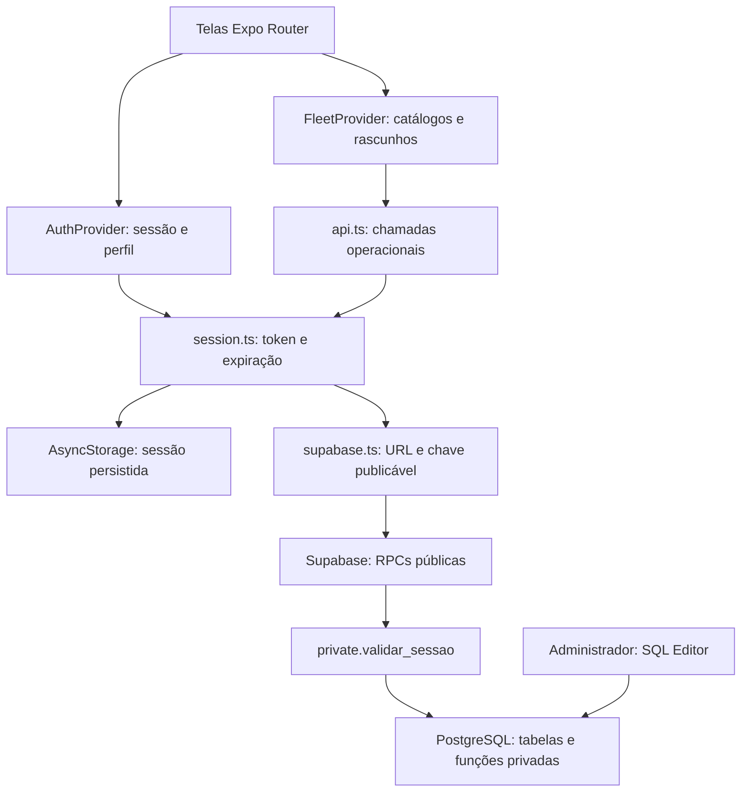

# Hashi App — documentação do projeto

**Revisão:** 18/09/2026. **Projeto técnico:** HashimotoFrota / `hashimoto-frota`.

**Revisão final dos filtros — 30/09/2026:** substitui o comportamento do adendo de filtros abaixo. Removidos os campos Período e Filtrar data por. Data inicial/final ficam sempre visíveis, inicialmente com hoje e os seis dias anteriores, e ambas são obrigatórias no aplicativo. Retiradas as ações “Sem data inicial/final”. A tentativa de aplicar sem uma data mostra mensagem abaixo do campo e borda laranja; ao preencher corretamente, a indicação desaparece. A tela retorna aos campos para facilitar a correção. Toda consulta usa `registros_frota.data` ou `manutencoes.data`, nunca a data do envio. Os demais campos permitem seleção múltipla com marcações e Concluir seleção: valores do mesmo campo são alternativas (Caxias **ou** Saquarema), combinadas com os outros campos (e autor Eduardo **ou** Wallace). Autores são exibidos com `nome` e `sobrenome` no filtro; o card mantém `nome` conforme o pedido anterior. O card agora separa a data/hora original do lançamento da data informada no registro. RPCs `filtrar_historico_multiplos` e `opcoes_filtros_historico_completas`, migração `202609300003_historico_multiplos.sql` aplicada no Supabase, sem alterar as anteriores. TypeScript, 50 testes locais, 15 fluxos Playwright e SQL remoto aprovados. Código/Expo atualizado; sem novo APK ou teste em Android físico.

**Adendo de 30/09/2026 — Filtros e período do Histórico:** o campo de busca livre foi substituído por **Filtros**, um painel recolhível com seletores pesquisáveis de motorista/responsável, placa, contrato, autor e tipo de manutenção (somente nessa categoria). O período inicial compreende hoje e os seis dias anteriores pela data do lançamento, no horário de Brasília. Em **Escolher datas**, é possível informar ambas ou deixar um dos limites aberto, e alternar para a data informada no registro. **Todo o período** retira o limite de datas. **Aplicar filtros** combina os critérios; **Cancelar** descarta a edição; **Restaurar últimos 7 dias** limpa tudo. Abaixo do último card semanal aparece: “Exibindo os últimos 7 dias. Para consultar lançamentos mais antigos, abra os filtros e escolha outro período.” O atalho Ajustar filtros abre o painel no topo. RPCs `filtrar_historico` e `opcoes_filtros_historico` instaladas pela migração `202609300002_filtros_historico.sql`; consultas antigas preservadas. Fonte/Expo atualizado, sem novo APK. TypeScript, 49 testes locais, 11 fluxos Playwright e teste SQL remoto com rollback aprovados; sem teste em Android físico.

**Adendo de 30/09/2026 — Autoria no Histórico:** cada card de alocação ou manutenção exibe **Lançado por: Nome**, sem precisar abrir detalhes. Usa exatamente `usuarios.nome`, incluindo nomes compostos, ligado ao `usuario_id` original do envio. Não concatena sobrenome nem substitui pelo login, motorista ou editor. Funciona também para envios antigos; mudanças posteriores no campo nome da conta aparecem na próxima consulta. A RPC `buscar_historico_com_autor` acrescenta `autor_nome` ao retorno e mantém filtros, paginação e permissões da consulta anterior, que continua disponível para clientes existentes. Migração `202609300001_historico_autor.sql` aplicada no Supabase. Nenhum novo APK nesta etapa; a compilação 8 não contém o novo texto.

**Adendo de 25/09/2026 — Observação na Manutenção:** o formulário agora possui **Observação (opcional)** entre Tipo de manutenção e Valor. Limite de 40 caracteres Unicode, contador visível, validação ao digitar/colar e enviar, e constraint no banco. O texto é salvo em `public.manutencoes.observacao` (anulável), carregado na edição e exibido nos detalhes do Histórico quando preenchido. A migração `202609250001_manutencao_observacao.sql` foi aplicada no Supabase. As RPCs novas recebem `p_observacao`; as assinaturas anteriores permanecem e preservam a observação em edições de APKs antigos. O limite não altera as regras de motorista, datas, autoria ou permissões. TypeScript, 45 testes locais e teste SQL remoto com rollback aprovados. Após autorização, gerado e verificado o APK **0.1 · compilação 8**, que inclui o campo; a compilação 7 anterior não o contém. [Download e instalação](INSTALAR-ANDROID.md). Android físico não testado. As demais seções deste manual conservam o levantamento de 18/09; o [documento de integração](HASHI-APP-INTEGRACAO-HASH-WEB.md) contém o contrato atualizado da manutenção.

Este manual reúne o funcionamento atual, as decisões principais e os procedimentos para desenvolver, administrar e entregar o aplicativo. Não reproduz os pedidos individuais de alterações visuais.

A documentação foi conferida no código, configurações, testes, relatórios de entrega e no banco Supabase por consultas somente de leitura. As contagens do banco correspondem a **18/09/2026 às 16:47:39, horário de Brasília** e podem mudar com o uso. Não foram consultadas senhas, hashes ou valores de tokens para este levantamento.

A [Referência do banco de dados](REFERENCIA-BANCO.md) complementa este manual com o inventário de campos, restrições, assinaturas das funções e permissões verificadas no servidor.

## Índice

1. [Objetivo e situação atual](#1-objetivo-e-situacao-atual)
2. [Tecnologias e ferramentas](#2-tecnologias-e-ferramentas)
3. [Arquitetura e fluxo de informações](#3-arquitetura-e-fluxo-de-informacoes)
4. [Estrutura de arquivos](#4-estrutura-de-arquivos)
5. [Etapas principais realizadas](#5-etapas-principais-realizadas)
6. [Preparar o ambiente de desenvolvimento](#6-preparar-o-ambiente-de-desenvolvimento)
7. [Usar os fluxos do aplicativo](#7-usar-os-fluxos-do-aplicativo)
8. [Modelo do banco de dados](#8-modelo-do-banco-de-dados)
9. [Autenticação e permissões](#9-autenticacao-e-permissoes)
10. [API, gravações e regras de consistência](#10-api-gravacoes-e-regras-de-consistencia)
11. [Administrar contas de acesso](#11-administrar-contas-de-acesso)
12. [Administrar funcionários, veículos e demais catálogos](#12-administrar-funcionarios-veiculos-e-demais-catalogos)
13. [Consultar envios e identificar autoria](#13-consultar-envios-e-identificar-autoria)
14. [Instalar e atualizar o banco](#14-instalar-e-atualizar-o-banco)
15. [Executar verificações e testes](#15-executar-verificacoes-e-testes)
16. [Gerar, verificar e instalar o APK](#16-gerar-verificar-e-instalar-o-apk)
17. [Git, cópias e manutenção do projeto](#17-git-copias-e-manutencao-do-projeto)
18. [Resolver problemas comuns](#18-resolver-problemas-comuns)
19. [Evidências, limites e próximas pendências](#19-evidencias-limites-e-proximas-pendencias)
20. [Mapa de fontes e documentos](#20-mapa-de-fontes-e-documentos)

<a id="1-objetivo-e-situacao-atual"></a>

## 1. Objetivo e situação atual

O **Hashi App** é um aplicativo interno para registrar alocações de equipes e veículos, registrar serviços de manutenção e consultar os envios. O uso depende de uma conta ativa e conexão com o Supabase.

| Termo | Significado no projeto |
| --- | --- |
| Alocação | Nome do card inicial; abre a rota `/registro` e grava em `registros_frota` e `registro_equipes`. |
| Registro | Nome usado no formulário, rodapé, categoria do Histórico e código para a alocação. |
| Manutenção | Serviço realizado em um veículo/equipamento, com data, contrato, motorista e custo. |
| Usuário | Conta que entra no app; fica em `public.usuarios`. |
| Funcionário do catálogo | Pessoa selecionada como responsável ou motorista; fica em `public.funcionarios`. |
| Administrador do app | Conta com `perfil = 'admin'`, com acesso aos envios de todos e permissão de exclusão. |
| Administrador do banco | Acesso administrativo ao Supabase/SQL Editor; pode cadastrar contas e administrar os catálogos. |

O administrador do app não recebe automaticamente acesso ao painel do Supabase. A conta de login também não é criada automaticamente quando alguém é inserido no catálogo de funcionários.

### Código atual e versão instalada

| Item | Estado confirmado |
| --- | --- |
| Nome do aplicativo | Hashi App. |
| Versão pública | `0.1`, definida em `app.json` e usada pelo menu. |
| Versão do pacote npm | `0.1.0`; formato técnico do `package.json`. |
| Código interno Android | `3`, em `android.versionCode`. |
| Identificador Android | `com.hashimoto.frota`. |
| Último APK entregue | `entrega/Hashi-App-0.1.apk`, 23.421.863 bytes, gerado em 18/09/2026. |
| Alteração posterior ao APK | Exibição da hora original do envio ao lado da data no Histórico. Está no código; exige um próximo APK. |
| Contas novas | Funcionam no APK existente, porque são administradas no banco. |
| Android físico | Instalação e fluxos completos não foram validados pelo agente em aparelho físico. |

Não há entrega iOS, publicação em loja ou atualização automática de código por EAS Update documentadas nesta configuração. A exportação web é usada para desenvolvimento e verificações; uma hospedagem web de produção não foi comprovada.

<a id="2-tecnologias-e-ferramentas"></a>

## 2. Tecnologias e ferramentas

As versões de dependências abaixo foram conferidas no `package-lock.json`. O `package.json` pode usar intervalos como `~` e `^`; `npm.cmd ci` instala o conjunto fixado pelo lockfile.

| Tecnologia | Versão verificada | Função |
| --- | --- | --- |
| Node.js | 24.12.0 nesta máquina | Executa as ferramentas JavaScript. |
| npm | 11.12.1 nesta máquina | Instala dependências e executa scripts. |
| Expo | 57.0.24 / SDK 57 | Desenvolvimento, configuração nativa e empacotamento. |
| React Native | 0.86.3 | Interface nativa Android. |
| React | 19.2.3 | Componentes, estado e contextos. |
| Expo Router | 57.0.22 | Navegação baseada nos arquivos de `src/app`. |
| TypeScript | 6.0.3 | Tipagem e verificação estática. |
| Supabase JS | 2.116.0 | Cliente das chamadas RPC ao PostgreSQL via API do Supabase. |
| PostgreSQL hospedado | 17.6 | Dados, regras transacionais, autenticação e autorização. |
| AsyncStorage | 2.2.0 | Persistência da sessão no dispositivo. |
| DateTimePicker | 9.1.0 | Calendário nativo; a web usa campo de data próprio. |
| React Native SVG | 15.15.4 | Ícones e ilustrações vetoriais. |
| Expo Build Properties | 57.0.21 | Configuração das otimizações do APK. |
| PGlite | 0.5.8 | PostgreSQL local para testes automatizados, sem usar dados de produção. |
| Playwright | 1.63.0 | Fluxos de interface no Chrome, com configuração Pixel 7. |
| Expo Doctor | 1.20.4 | Conferência de compatibilidade do projeto Expo. |
| Prettier | 3.9.6 | Formatação de código e documentos. |
| Sharp | 0.35.4 | Preparação determinística de imagens/recursos do aplicativo. |
| EAS CLI | 24.7.0 utilizada nos builds recentes | Compilação remota e credenciais Android. |
| Supabase CLI | 2.117.0 utilizada nas consultas recentes | Administração e consulta do projeto Supabase. |
| Git | 2.52.0.windows.1 nesta máquina | Versionamento dos arquivos do projeto. |

O projeto também depende de módulos Expo de constantes, criptografia/UUID, abertura, fontes, links e barras do sistema; e de bibliotecas de gestos, animações, telas, área segura, web e compatibilidade de URLs. A relação completa está em [package.json](../package.json).

**Outras ferramentas utilizadas:** VS Code, PowerShell e atalhos `.cmd`; Python na importação inicial e em verificações locais de APK; OpenSSL na verificação local da assinatura APK v2. Python e OpenSSL não são dependências de execução do aplicativo.

O ambiente Node 24.12.0 foi usado nas verificações registradas. Não se deve escolher uma versão antiga de Node apenas porque uma dependência isolada a aceita: o Supabase JS instalado exige Node 22 ou superior, e React Native/Expo Doctor possuem requisitos próprios registrados no lockfile.

<a id="3-arquitetura-e-fluxo-de-informacoes"></a>

## 3. Arquitetura e fluxo de informações

O aplicativo se comunica com a API do Supabase, que executa funções PostgreSQL. Não existe um servidor Express, Nest ou outra API própria separada neste repositório.



### Fluxo de uma alocação

1. O usuário entra com login e senha; a função `autenticar_usuario` devolve sessão e perfil.
2. O app consulta `listar_catalogos` usando o token da sessão.
3. O formulário nasce com UUID, data local de hoje e uma equipe vazia.
4. O usuário seleciona IDs de contrato, responsável e veículo; o texto da busca apenas filtra opções.
5. A validação local confere os campos e as repetições de funcionário/veículo entre equipes.
6. `api.ts` chama `salvar_registro`, incluindo `p_token` e as equipes em JSON.
7. O banco valida sessão, atividade, data e referências e grava o registro pai e suas equipes em uma transação.
8. O banco atribui `usuario_id` a partir da sessão e `created_at` a partir do relógio do servidor.
9. O app apresenta sucesso. Ao abrir o Histórico, consulta o que está salvo no banco.

Na manutenção, o fluxo é equivalente, com tipo de serviço, veículo, motorista ou escolha explícita de motorista não identificado, contrato e custo.

### Onde cada tipo de informação fica

| Informação | Local |
| --- | --- |
| Componentes, validações, imagens e configuração pública | Código e pacote do aplicativo. |
| Catálogos e envios reais | PostgreSQL hospedado no Supabase. |
| Senha da conta | Hash bcrypt no schema privado; a senha legível não é devolvida pelo banco. |
| Sessão atual | Token em memória e AsyncStorage; hash do token no banco. |
| Formulário ainda não enviado | Memória do `FleetProvider`; não é persistido após fechar o app. |
| Exemplos do modo demonstração | Memória local, sem gravação no Supabase. |
| Credenciais das ferramentas e cópias locais de acesso | Ambiente administrativo local, fora do APK e do versionamento. |

<a id="4-estrutura-de-arquivos"></a>

## 4. Estrutura de arquivos

```text
HashimotoFrota/
├── src/
│   ├── app/
│   │   ├── _layout.tsx              Contexto de autenticação e navegação raiz
│   │   ├── index.tsx                Entrada e acesso à demonstração
│   │   ├── login.tsx                Login por usuário/senha
│   │   ├── recuperar-senha.tsx      Recuperação em duas etapas
│   │   ├── +not-found.tsx           Rota inexistente
│   │   └── (frota)/
│   │       ├── _layout.tsx          Proteção das rotas e contexto da frota
│   │       ├── inicio.tsx           Serviços e Histórico
│   │       ├── registro.tsx         Alocação de equipes/veículos
│   │       ├── manutencao.tsx       Manutenção e custo
│   │       ├── historico.tsx        Consulta, filtros, edição e exclusão
│   │       └── editar.tsx           Carrega e reutiliza o formulário correspondente
│   ├── components/                 Componentes de interface compartilhados
│   ├── providers/                  AuthProvider e FleetProvider
│   ├── lib/                        API, sessão, validação, formatação e tema
│   ├── types/models.ts             Tipos do domínio
│   └── data/demo.ts                Catálogos ilustrativos
├── assets/                         Marca, ícone e abertura
├── supabase/
│   ├── migrations/                 Oito migrações SQL, em ordem cronológica
│   ├── tests/                      Consultas e testes SQL administrativos
│   ├── cadastros.json              Cadastros do pedido inicial
│   ├── instalar.sql                Apenas as duas migrações iniciais consolidadas
│   └── config.toml                 Configuração do Supabase local
├── tests/
│   ├── *.test.ts                   Regras, busca, autenticação e banco local
│   ├── ui/                         Fluxos em demonstração
│   └── auth-ui/                    Fluxos com API simulada
├── scripts/                        Ferramentas operacionais e históricas
├── docs/                           Manual, referência do banco e guias específicos
├── entrega/                        APKs e verificações locais; ignorada pelo Git
├── copias/                         ZIPs locais; ignorada pelo Git
├── .tools/                         Caches, ferramentas e artefatos administrativos locais
├── app.json                        Identidade, versão e configuração Expo/Android
├── eas.json                        Perfis de compilação
├── package.json / package-lock.json Dependências e scripts
├── tsconfig.json                   TypeScript estrito e aliases
├── metro.config.js                 Empacotador, exclusões e limite de workers
├── playwright*.config.ts           Configurações das duas suítes web
├── .env.example                    Modelo sem valores de acesso
├── .gitignore / .easignore          Exclusões de versionamento e envio ao EAS
├── README.md                       Entrada rápida e links
└── AGENTS.md                       Registro de continuidade e revisões históricas
```

Os diretórios nativos `android/` e `ios/` não estão presentes nesta cópia. A configuração nativa é gerada a partir do Expo e dos plugins durante o processo de build.

### Componentes e bibliotecas locais principais

| Arquivo | Responsabilidade |
| --- | --- |
| `AppShell.tsx` | Cabeçalho, rodapé, menu da conta, versão e faixa de demonstração. |
| `SearchSelect.tsx` | Modal pesquisável, escolha por ID, destaque do nome e limpeza da seleção. |
| `DateField.tsx` | Data no Android/web e limite até hoje. |
| `PasswordField.tsx` | Campo com mostrar/ocultar senha e rótulos acessíveis. |
| `FormScreen.tsx`, `Button.tsx`, `Feedback.tsx` | Estrutura de formulário, ações, erros e sucesso. |
| `Brand.tsx`, `Icon.tsx`, `HomeArtwork.tsx` | Marca e recursos visuais compartilhados. |
| `lib/session.ts` | Login, logout, armazenamento, restauração e expiração da sessão. |
| `lib/api.ts` | Consulta de perfil/catálogos, gravação, obtenção, edição, exclusão e Histórico. |
| `lib/validation.ts` | Validação dos formulários e detecção de repetições. |
| `lib/format.ts` | Datas, hora de envio, moeda, normalização e mensagens de erro. |
| `lib/nameSearch.ts` | Busca por partes do nome em ordem e intervalos de destaque. |
| `lib/login.ts` | Normalização e validação do nome de usuário. |
| `lib/theme.ts` | Cores e estilos comuns. |

O alias `@/` aponta para `src/`; `@/assets/` aponta para os recursos da raiz. TypeScript usa `strict`, `react-jsx`, `module: preserve` e `moduleResolution: bundler`.

### Scripts e atalhos

| Arquivo | Uso e observação |
| --- | --- |
| `INICIAR.cmd`, `ABRIR-WEB.cmd` | Iniciam Expo e Expo Web. |
| `CONECTAR-CONTAS.cmd` | Login nas ferramentas Expo/EAS e Supabase; não cadastra usuários do app. |
| `VER-ACESSOS.cmd`, `VER-ACESSO-ADMIN.cmd` | Consultam cópias locais protegidas de acessos antigos. Não leem senhas do banco e não incluem automaticamente contas novas. |
| `COPIAR-PROJETO.cmd`, `scripts/copiar-projeto.ps1` | Geram ZIP do projeto sem dependências, caches, APKs, `.env` e credenciais protegidas. |
| `scripts/check-env.mjs` | Confere URL, chave pública e vínculo EAS local. Não valida login nem disponibilidade do banco. |
| `scripts/verificar-conexao.mjs` | Confere bloqueio de leitura anônima nas oito tabelas e de Histórico sem sessão. |
| `scripts/verificar-edicao-remota.ps1/.mjs` | Testa API/navegador com contas reais locais e envios temporários; não é teste somente de leitura. |
| `scripts/conectar-supabase.ps1` | Configura `.env` e variáveis públicas dos ambientes EAS; exige autenticação administrativa nas ferramentas. |
| `scripts/prepare-launcher-icon.mjs` | Prepara recursos quadrados a partir de `assets/iconn.png`, preservando o original. |
| `scripts/generate-splash.mjs` | Gera a imagem de abertura. |
| `scripts/generate-assets.mjs` | Gerador visual antigo; não prepara o ícone atual. Não executar como parte de um build normal. |
| `scripts/import-brief.py` | Importação inicial; reescreve solicitação/cadastros/seed. Não é sincronização do banco atual. |
| `scripts/prepare-database.mjs` | Regera `instalar.sql` com somente as duas migrações iniciais. |
| `scripts/configurar-usuarios.ps1`, `scripts/criar-administrador.ps1` | Ferramentas antigas desativadas com erro explícito; não usar para cadastrar contas. |
| `scripts/atualizar-nomes-iniciais.sql` | Ajuste histórico específico de contas iniciais; não é um cadastro genérico. |

<a id="5-etapas-principais-realizadas"></a>

## 5. Etapas principais realizadas

Esta sequência vem das migrações, documentos e verificações da conversa. Ela não é uma reconstrução de commits: o Git atual tem um primeiro commit de 18/09/2026.

| Etapa | Resultado principal |
| --- | --- |
| Base inicial, arquivos de 10/09 | Organização do pedido, importação dos cadastros, estrutura Expo/TypeScript, oito tabelas públicas, formulários e Histórico. |
| Revisões de 15/09 | Edição com controle de versão, exclusão administrativa, permissões, preservação dos envios e cadastro por usuário. A solução com Supabase Auth foi substituída por autenticação própria no PostgreSQL. |
| Revisões de 16/09 | Recuperação de senha com código temporário, nome e sobrenome separados, categorias de Histórico e reutilização dos formulários na edição. |
| Revisões de 17/09 | Bloqueio de datas futuras, motorista não identificado com `NULL`, tipo Outros, ordem dos campos e primeiro APK verificado. |
| Revisões de 18/09 | Busca de funcionários por partes em ordem com destaque, APK otimizado, identidade Hashi App/versão 0.1 e criação das novas contas solicitadas. |
| Após o APK 0.1 | Hora original do envio adicionada ao Histórico no código. Ainda não incorporada ao APK entregue. |
| Consolidação atual | Manual e referência de banco, conferência de estrutura/permissões reais e registro das diferenças entre dados iniciais, servidor e artefato entregue. |

O primeiro APK tinha 49.211.807 bytes; o APK 0.1 tem 23.421.863 bytes, redução de aproximadamente **52,41%**. Mantiveram-se as funcionalidades e o suporte a ARM de 32 e 64 bits. Isso mede o arquivo para download, não o espaço instalado nem o desempenho no aparelho.

<a id="6-preparar-o-ambiente-de-desenvolvimento"></a>

## 6. Preparar o ambiente de desenvolvimento

### 6.1. Obter os arquivos e instalar as ferramentas

1. Obtenha o repositório autorizado ou uma cópia gerada por `COPIAR-PROJETO.cmd`.
2. Instale uma versão de Node compatível com as dependências; o ambiente verificado usa **24.12.0**.
3. Abra a pasta raiz no VS Code e use um terminal PowerShell.
4. Confira as versões e instale exatamente o lockfile:

```powershell
node --version
npm.cmd --version
npm.cmd ci
```

O sufixo `.cmd` evita chamar os wrappers `.ps1` de npm/npx bloqueados por algumas configurações do PowerShell. `.npmrc` direciona o cache para `.tools/npm-cache`.

### 6.2. Configurar a conexão do aplicativo

1. Crie `.env` a partir do modelo, sem sobrescrever uma configuração já existente:

```powershell
if (-not (Test-Path -LiteralPath '.env')) {
  Copy-Item -LiteralPath '.env.example' -Destination '.env'
}
```

2. Preencha o arquivo com a URL e a chave **publishable** do projeto autorizado:

```dotenv
EXPO_PUBLIC_SUPABASE_URL=https://qxkhjlkexsjgkttdugqt.supabase.co
EXPO_PUBLIC_SUPABASE_PUBLISHABLE_KEY=sb_publishable_PREENCHA_NO_AMBIENTE_LOCAL
```

3. Execute `node scripts/check-env.mjs`.
4. Reinicie o servidor Expo após mudar variáveis. Valores de ambiente do cliente entram no bundle; uma instalação já distribuída exige recompilação para trocar a conexão.

O placeholder acima não é uma chave funcional. Somente valores `sb_publishable_` são aceitos pelo cliente atual. Senha do banco, chave secret/service_role, tokens de ferramentas e credenciais de assinatura não fazem parte dessa configuração pública.

### 6.3. Abrir no navegador

```powershell
npm.cmd run web
```

Use a URL apresentada pelo Expo. O código de banco é o mesmo usado pelo app: com `.env` real, operações manuais da interface usam o banco real.

### 6.4. Abrir durante o desenvolvimento Android

```powershell
npm.cmd start
```

Use o Expo Go compatível com SDK 57 conforme as orientações do Expo. Computador e aparelho precisam conseguir alcançar o servidor de desenvolvimento. O APK distribuído funciona independentemente desse servidor e do Expo Go.

### 6.5. Acessar a demonstração

A opção **Conhecer as telas** existe somente em desenvolvimento, quando a configuração Supabase não está válida. Não aparece como alternativa de acesso no APK de produção. Para um ambiente isolado sem carregar `.env`, use o procedimento de testes da seção 15.

### 6.6. Entender os ambientes

| Ambiente | Fonte de configuração | Uso |
| --- | --- | --- |
| Desenvolvimento conectado | `.env` local | Desenvolvimento com o banco configurado. |
| Demonstração | Supabase não configurado, `__DEV__` | Exemplos em memória. |
| Testes com API simulada | Valores públicos fictícios e interceptação Playwright | Interface sem alterar dados reais. |
| EAS `preview` | Variáveis remotas do ambiente `preview` | APK interno. |
| EAS `production` | Variáveis remotas do ambiente `production` | Outro perfil de APK; não comprova publicação em loja. |

Não existe separação de dois bancos garantida apenas pelos nomes `preview` e `production`: a URL configurada em cada ambiente determina qual banco será usado. O build 0.1 conferido utiliza o projeto Supabase deste manual.
