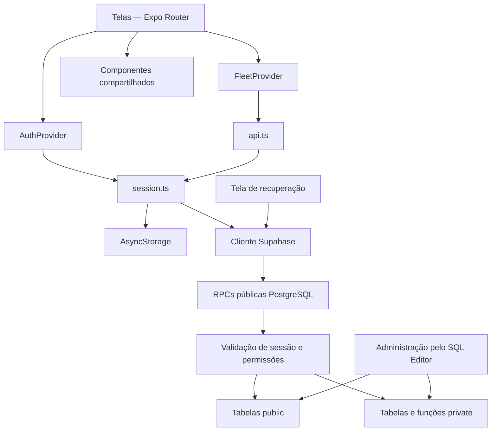
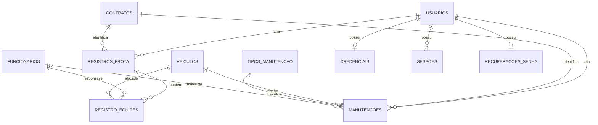
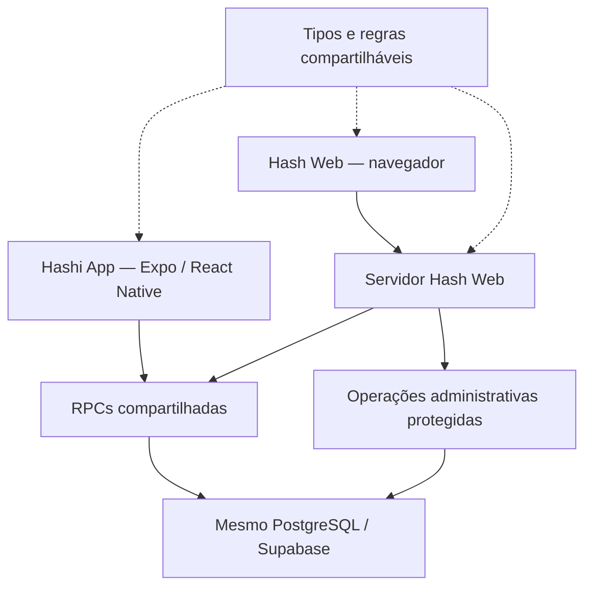

# HASHI APP — DOCUMENTAÇÃO PARA INTEGRAÇÃO COM HASH WEB

**Data da análise: 23/09/2026.**

**Revisão final de 30/09/2026 — Datas diretas e seleção múltipla.** Substitui a interface da revisão de filtros abaixo: removidos Período e Filtrar data por; datas sempre operacionais, com Data inicial/final diretamente editáveis e obrigatórias no aplicativo. Sem ações “Sem data inicial/final”; mensagens e bordas laranja surgem ao tentar aplicar com datas ausentes ou inválidas e desaparecem ao corrigir. Os demais campos aceitam várias opções; autores mostram nome e sobrenome no seletor. O card exibe data/hora do lançamento e data do registro separadas. Migração `202609300003_historico_multiplos.sql` aplicada e registrada (treze migrações locais). TypeScript, 50 testes locais, 15 fluxos Playwright e SQL remoto aprovados; nenhum novo APK e nenhum teste em Android físico.

**Revisão pontual: 30/09/2026 — Filtros combinados e semana inicial.** O app agora usa `filtrar_historico` e `opcoes_filtros_historico`, instaladas no Supabase pela migração `202609300002_filtros_historico.sql` (doze migrações locais). O painel recolhível combina datas, motorista, placa, contrato, autor e tipo de manutenção, com padrão de sete dias pela data do envio em Brasília. Conferidos TypeScript, 49 testes locais, 11 fluxos Playwright e SQL remoto com rollback. RPCs antigas mantidas para clientes existentes; não há novo APK nem teste em Android físico. Esta revisão não é uma nova auditoria integral do projeto.

**Revisão pontual: 30/09/2026 — Autoria no Histórico.** Cards dos dois tipos exibem **Lançado por: Nome** usando o campo `usuarios.nome` completo, sem adicionar sobrenome ou login. A RPC nova `buscar_historico_com_autor` acrescenta `autor_nome: text`; a RPC `buscar_historico` mantém seu contrato anterior. A migração `202609300001_historico_autor.sql` foi aplicada no Supabase e registrada no ledger, totalizando onze migrações locais. Validação SQL local e remota com rollback confirmou autoria original após edição, nomes compostos, permissões, filtros e paginação. Fonte/Expo atualizados; nenhum APK novo, e a compilação 8 não possui a exibição. As demais conclusões permanecem vinculadas às revisões anteriores.

**Revisão pontual: 25/09/2026 — Observação na Manutenção.** Atualizados o formulário, os tipos e o contrato das RPCs para o campo opcional de 40 caracteres. A migração `202609250001_manutencao_observacao.sql` foi aplicada e testada no Supabase com rollback dos dados temporários. Essa revisão incluiu alterações e testes; a descrição de levantamento somente de leitura abaixo se refere à análise original de 23/09. As demais conclusões continuam vinculadas àquela análise, sem nova auditoria completa.

Este documento preserva a análise realizada em modo de leitura. Durante o levantamento, nenhum arquivo, migration ou dado no Supabase foi alterado, e não foram executados builds nem testes que gerassem arquivos ou modificassem dados. A criação deste documento foi autorizada posteriormente pelo usuário.

Foram examinados os fontes do aplicativo, configurações, dependências, nove migrações SQL, testes, scripts administrativos e documentação disponível.

Em 25/09, a pasta passou a conter **dez migrações**, com a inclusão da observação. A consulta remota desta revisão confirmou as funções de manutenção anteriores usadas como base e a nova coluna, constraint, assinaturas e permissões. O ledger remoto ainda não registra `202609170001` e `202609220001`; essa divergência anterior não foi reparada automaticamente. A aplicação de `202609250001` está registrada. Não se deve usar a ausência de uma linha no ledger como prova de ausência das respectivas alterações no schema.

As classificações usadas são:

- **Fato:** comportamento identificado no código ou nas migrações.
- **Inferência:** consequência técnica da implementação encontrada.
- **Recomendação:** proposta para o futuro Hash Web.
- **Pendente de confirmação:** informação que exige consulta ao ambiente remoto ou validação operacional.

**Limite da análise original:** o modelo de banco apresentado corresponde ao resultado das migrações locais. Em 23/09 não foi feita uma nova consulta ao Supabase hospedado. Em 25/09 houve a conferência pontual de manutenção descrita acima; isso não comprova equivalência integral de todas as definições remotas.

## 1. Resumo executivo

O **Hashi App** é um aplicativo interno para registrar:

1. Alocações de responsáveis e veículos em contratos.
2. Serviços e custos de manutenção.
3. Histórico dos envios, com consulta, edição e exclusão conforme o perfil.

O aplicativo utiliza React Native, Expo e TypeScript. Os dados persistentes ficam no PostgreSQL do Supabase.

**É tecnicamente viável criar o Hash Web como uma aplicação separada utilizando o mesmo banco.** As operações principais já estão concentradas em funções PostgreSQL, chamadas pelo aplicativo por RPC.

Os pontos mais importantes para essa integração são:

| Assunto                  | Estado encontrado                                                                                          |
| ------------------------ | ---------------------------------------------------------------------------------------------------------- |
| Autenticação             | Própria, por usuário e senha no PostgreSQL. O fluxo atual não utiliza Supabase Auth.                       |
| Comunicação              | RPCs do Supabase; o aplicativo não faz CRUD operacional direto nas tabelas.                                |
| Permissões               | Funcionário consulta e edita seus próprios envios; administrador consulta e edita todos e pode excluir.    |
| Catálogos                | Funcionários, veículos, contratos e tipos de manutenção compartilhados.                                    |
| Administração            | Cadastro de usuários e administração cadastral dependem atualmente de acesso administrativo ao banco.      |
| Concorrência             | Edição usa `versao`; criação usa UUID e tratamento de repetição do envio.                                  |
| Duplicidades nas equipes | Bloqueadas no cliente, mas sem proteção equivalente nas funções SQL encontradas.                           |
| Sincronização            | Os dados são compartilháveis, mas as telas não recebem atualização automática em tempo real.               |
| Offline                  | Não há fila persistente de envios nem sincronização offline.                                               |
| Hash Web                 | Ainda não existe neste projeto; a exportação Expo Web atual é o próprio aplicativo executado no navegador. |

**Recomendação principal:** preservar o banco e as RPCs atuais como base do ecossistema, criar uma interface Web própria e acrescentar operações administrativas protegidas onde hoje só existe administração pelo SQL Editor.

## 2. Objetivo do sistema

### Visão funcional

O sistema organiza informações operacionais da frota.

Na **Alocação**, uma pessoa informa a data, o contrato e uma ou mais equipes. Cada equipe contém um responsável e um veículo.

Na **Manutenção**, informa a data, o contrato, o veículo, o motorista — ou a escolha de motorista não identificado —, o tipo de serviço, uma observação opcional de até 40 caracteres e o custo.

O **Histórico** reúne esses envios e permite consultar detalhes, corrigir informações e, para administradores, excluir registros.

O público é composto por usuários internos, incluindo funcionários e supervisores. Entretanto, **“supervisor” não é um perfil técnico separado**: o código reconhece apenas `funcionario` e `admin`.

### Distinções necessárias

| Termo                       | Significado atual                                                     |
| --------------------------- | --------------------------------------------------------------------- |
| Usuário                     | Conta que entra no aplicativo.                                        |
| Funcionário                 | Pessoa do catálogo selecionada como responsável ou motorista.         |
| Administrador do aplicativo | Usuário com `perfil = 'admin'`.                                       |
| Administrador do banco      | Pessoa com acesso administrativo ao Supabase/SQL Editor.              |
| Alocação                    | Funcionalidade cujo código e banco ainda utilizam o termo `registro`. |
| Equipe                      | Item de uma alocação, contendo um responsável e um veículo.           |

**Fato:** cadastrar alguém em `funcionarios` não cria uma conta de acesso. Criar uma conta em `usuarios` também não cria automaticamente um funcionário.

### Visão técnica

A interface mantém formulários e catálogos em memória, valida os dados e chama funções PostgreSQL pelo Supabase.

As funções verificam a sessão, aplicam permissões e executam as gravações. Não existe um servidor próprio Express, Nest ou equivalente neste repositório.

## 3. Stack atual

Versões principais confirmadas no `package-lock.json`:

| Tecnologia       | Versão/configuração                         | Utilização                                    |
| ---------------- | ------------------------------------------- | --------------------------------------------- |
| TypeScript       | `6.0.3`                                     | Tipagem estrita.                              |
| React            | `19.2.3`                                    | Componentes, estado e contextos.              |
| React Native     | `0.86.3`                                    | Interface mobile.                             |
| Expo             | `57.0.24`                                   | Desenvolvimento e configuração do aplicativo. |
| Expo Router      | `57.0.22`                                   | Navegação por arquivos.                       |
| React Native Web | `0.21.2`                                    | Execução da interface no navegador.           |
| Supabase JS      | `2.116.0`                                   | Chamadas RPC ao Supabase.                     |
| PostgreSQL       | Versão principal `17` na configuração local | Persistência, autenticação e regras.          |
| AsyncStorage     | `2.2.0` declarado                           | Persistência da sessão.                       |
| DateTimePicker   | `9.1.0` declarado                           | Seleção nativa de datas.                      |
| React Native SVG | `15.15.4` declarado                         | Ícones e ilustrações.                         |
| PGlite           | `0.5.8`                                     | Testes de banco local.                        |
| Playwright       | `1.63.0`                                    | Testes de interface web.                      |

Outras características:

- Estado global com **React Context**, sem Redux ou Zustand.
- Formulários controlados manualmente, sem React Hook Form ou Formik.
- Validação própria, sem Zod ou Yup.
- Formatação de moeda com `Intl.NumberFormat`.
- Datas com funções JavaScript próprias.
- Configuração TypeScript com `strict`, `react-jsx` e `moduleResolution: bundler`.
- APK gerado por EAS Build.

A configuração atual identifica o aplicativo como **Hashi App**, versão pública **0.1**, compilação Android **7**.

O relatório local de entrega registra um APK de aproximadamente **23,4 MB**, com integridade e assinatura verificadas. Esse relatório também informa que **não houve teste em Android físico**. Essas verificações não foram repetidas nesta análise.

## 4. Arquitetura



### Camadas reais

| Camada                  | Responsabilidade                                                  |
| ----------------------- | ----------------------------------------------------------------- |
| `src/app`               | Rotas, telas, interação e navegação.                              |
| `src/components`        | Elementos reutilizáveis de interface.                             |
| `AuthProvider`          | Sessão, perfil, entrada, saída e retomada do aplicativo.          |
| `FleetProvider`         | Catálogos, opções dos seletores, rascunhos e acesso às operações. |
| `src/lib/api.ts`        | Tradução dos modelos do cliente para as RPCs operacionais.        |
| `src/lib/session.ts`    | Armazenamento da sessão e inclusão de `p_token` nas chamadas.     |
| `src/lib/supabase.ts`   | Configuração do cliente Supabase.                                 |
| `src/lib/validation.ts` | Validações locais dos formulários.                                |
| Funções PostgreSQL      | Autenticação, autorização, consultas e transações.                |

### Organização dos provedores

Na raiz:

`SafeAreaProvider → AuthProvider → Stack`

Nas rotas protegidas:

`FleetProvider → SelectOverlayProvider → AppShell → tela`

O `FleetProvider` é identificado pela conta atual. Isso separa seus estados entre usuários.

O `SelectOverlayProvider` mantém uma camada compartilhada para os seletores pesquisáveis. A abertura atual desses seletores não cria um `Modal` nativo por campo.

## 5. Estrutura de arquivos

Estrutura relevante encontrada:

```text
HashimotoFrota/
├── src/
│   ├── app/
│   │   ├── _layout.tsx
│   │   ├── index.tsx
│   │   ├── login.tsx
│   │   ├── recuperar-senha.tsx
│   │   ├── +not-found.tsx
│   │   └── (frota)/
│   │       ├── _layout.tsx
│   │       ├── inicio.tsx
│   │       ├── registro.tsx
│   │       ├── manutencao.tsx
│   │       ├── historico.tsx
│   │       └── editar.tsx
│   ├── components/
│   │   ├── AppShell.tsx
│   │   ├── AppVersion.tsx
│   │   ├── AllocationVehicleSelect.tsx
│   │   ├── SearchSelect.tsx
│   │   ├── SelectOverlay.tsx
│   │   ├── DateField.tsx
│   │   ├── PasswordField.tsx
│   │   ├── FormScreen.tsx
│   │   └── componentes visuais e de feedback
│   ├── providers/
│   │   ├── AuthProvider.tsx
│   │   └── FleetProvider.tsx
│   ├── lib/
│   │   ├── api.ts
│   │   ├── session.ts
│   │   ├── supabase.ts
│   │   ├── validation.ts
│   │   ├── login.ts
│   │   ├── format.ts
│   │   ├── nameSearch.ts
│   │   ├── searchOptions.ts
│   │   └── theme.ts
│   ├── types/
│   │   └── models.ts
│   └── data/
│       └── demo.ts
├── assets/
├── supabase/
│   ├── migrations/
│   ├── tests/
│   ├── cadastros.json
│   ├── instalar.sql
│   └── config.toml
├── tests/
│   ├── *.test.ts
│   ├── ui/
│   └── auth-ui/
├── scripts/
├── docs/
├── entrega/
├── app.json
├── eas.json
├── package.json
├── package-lock.json
├── tsconfig.json
├── metro.config.js
├── playwright.config.ts
├── playwright.auth.config.ts
├── .env.example
├── .gitignore
├── .easignore
├── README.md
└── AGENTS.md
```

### Responsabilidades complementares

- **`assets/`:** identidade visual, ícone e abertura.
- **`supabase/migrations/`:** evolução do esquema, funções e permissões.
- **`supabase/tests/`:** consultas de diagnóstico e testes SQL; alguns fazem escritas temporárias com rollback.
- **`tests/`:** validação, busca, autenticação, permissões e interface.
- **`scripts/`:** preparação de recursos, configuração, verificações e operações administrativas.
- **`docs/`:** guias operacionais e documentos com diferentes datas de atualização.
- **`entrega/`:** APKs e relatórios de verificação.
- **`.tools/`, `.expo/`, `node_modules/`, `test-results/`:** ferramentas, caches, dependências e resultados; não representam módulos do produto.

Não existem pastas próprias chamadas `screens`, `services`, `hooks` ou `contexts`. Essas responsabilidades estão distribuídas entre `app`, `lib` e `providers`.

Não há diretórios nativos `android/` e `ios/` nesta cópia. A configuração nativa é declarada pelo Expo.

## 6. Usuários e autenticação

### 6.1 Modelo utilizado

**O fluxo atual utiliza autenticação própria implementada no PostgreSQL.**

Não utiliza:

- E-mail como identificador.
- Login pelo Supabase Auth.
- `supabase.auth.signInWithPassword`.
- Sessão de usuário baseada no JWT do Supabase Auth.

A presença de uma seção `[auth]` em `supabase/config.toml` não muda esse fato: o código atual autentica por RPC própria.

### 6.2 Login

O usuário informa:

- Nome de acesso.
- Senha.

O login é normalizado com remoção de espaços nas extremidades e conversão para minúsculas.

Formato permitido:

- De 3 a 40 caracteres.
- Primeira posição deve ser uma letra de `a` a `z`.
- Demais posições: letras, números ou `_`.

A senha é enviada para `public.autenticar_usuario`.

Essa função:

1. Verifica o limite de tentativas.
2. Procura a conta pelo login.
3. Compara a senha com o hash.
4. Exige conta ativa.
5. Cria uma sessão.
6. Retorna token, expiração, identificador e perfil.

### 6.3 Senhas

As senhas ficam em `private.credenciais.senha_hash`.

- Novas senhas usam **bcrypt**, custo 12 e salt aleatório.
- Não existe coluna de senha legível em `public.usuarios`.
- A senha não é devolvida pelo login.
- Novas definições exigem pelo menos 12 caracteres e no máximo 72 bytes.
- **Não há expiração automática de senha implementada.**

A coluna `updated_at` de `private.credenciais` registra a atualização da credencial.

### 6.4 Sessões

O token é composto por 32 bytes aleatórios, representados por 64 caracteres hexadecimais.

| Local               | Conteúdo                                         |
| ------------------- | ------------------------------------------------ |
| Banco               | Hash SHA-256 do token.                           |
| Aplicativo          | Token original, expiração e ID do usuário.       |
| Armazenamento local | AsyncStorage, chave `hashi.username-session.v1`. |

Regras:

- Validade de sete dias.
- Até dez sessões por usuário.
- Novos logins removem sessões antigas acima do limite.
- Não há renovação deslizante implementada.
- Cada RPC operacional valida novamente a sessão e a atividade da conta.
- O erro SQL `28000` faz o aplicativo apagar a sessão local e retornar ao acesso.

A identidade validada é colocada no contexto transacional PostgreSQL por `private.validar_sessao`, usando `hashi.usuario_id`. As funções consultam essa identidade por `private.usuario_id()`.

**Esse token não é um JWT e não deve ser tratado como token do Supabase Auth.**

### 6.5 Logout

`encerrar_sessao` remove a sessão correspondente no banco. O aplicativo também remove o estado em memória e no AsyncStorage.

**Ponto de atenção:** o cliente limpa a sessão local mesmo se a comunicação falhar. Além disso, o retorno de erro dessa RPC não é verificado explicitamente em `signOut`. Portanto, a limpeza local não comprova, sozinha, revogação remota.

### 6.6 Recuperação

O fluxo é:

1. Administrador do banco confirma a identidade.
2. Executa `gerar_codigo_recuperacao`.
3. Entrega o código à pessoa.
4. A pessoa informa login e código no aplicativo.
5. `validar_codigo_recuperacao` devolve uma autorização temporária.
6. A pessoa informa nova senha e confirmação.
7. `recuperar_senha` altera a credencial.

Prazos e limites:

| Elemento              | Regra                                               |
| --------------------- | --------------------------------------------------- |
| Código                | Válido por 30 minutos.                              |
| Tentativas incorretas | Máximo de cinco por código.                         |
| Uso do código         | Uma validação bem-sucedida consome o código.        |
| Autorização de troca  | Válida por dez minutos.                             |
| Novo código           | Substitui o anterior.                               |
| Troca concluída       | Revoga sessões anteriores e invalida a recuperação. |
| Nova senha            | Permanece válida até outra alteração.               |

A autorização de recuperação fica somente em memória no aplicativo.

### 6.7 Criação e administração de contas

Não existe tela de cadastro de usuários no aplicativo.

A função administrativa atual é:

`public.cadastrar_usuario(p_usuario, p_senha, p_perfil, p_nome, p_sobrenome)`

Ela:

- Valida os campos.
- Exige nome e sobrenome para novos cadastros.
- Recusa login existente sem redefinir a senha.
- Cria perfil e credencial na mesma transação.
- Cria a conta ativa.

Também existem:

- `definir_senha_usuario`: redefinição administrativa.
- `gerar_codigo_recuperacao`: emissão do código.

Essas funções têm execução concedida a `postgres`, com revogação para `anon`, `authenticated` e `service_role`.

**Ser administrador do aplicativo não concede automaticamente permissão para chamar essas funções administrativas.**

### 6.8 Perfis

| Perfil        | Permissões operacionais                                              |
| ------------- | -------------------------------------------------------------------- |
| `funcionario` | Criar envios; consultar e editar os próprios.                        |
| `admin`       | Criar envios; consultar, editar e excluir envios de todas as contas. |

As permissões dependem de `perfil`, não do texto do login.

## 7. Funcionalidades

### 7.1 Entrada, login e menu

| Fluxo              | Objetivo e dados                                | Persistência/navegação                |
| ------------------ | ----------------------------------------------- | ------------------------------------- |
| `/`                | Marca, estado de carregamento e botão Entrar.   | Direciona para login ou início.       |
| `/login`           | Usuário, senha, visibilidade da senha e versão. | Autentica e persiste a sessão.        |
| `/recuperar-senha` | Código, nova senha e confirmação.               | Usa RPCs de recuperação.              |
| Menu da conta      | Nome completo, perfil, versão e saída.          | Acesso ao início, Histórico e logout. |
| Rota inexistente   | Orienta retorno ao início.                      | Não grava dados.                      |

As rotas de frota exigem sessão e perfil ativo, exceto na demonstração de desenvolvimento.

### 7.2 Tela inicial

`inicio.tsx` apresenta:

- Saudação com a primeira palavra de `profile.nome`.
- Card **Alocação**.
- Card **Manutenção**.
- Card **Histórico**.
- Texto informativo.

Não apresenta indicadores calculados, contagens ou painel gerencial.

Existe uma diferença de nomenclatura atual: o card usa **Alocação**, mas formulário, rodapé, Histórico e identificadores internos ainda utilizam **Registro** em vários lugares.

### 7.3 Alocação

Rota: `/registro`.

#### Campos

| Campo                      | Origem/formato                         |
| -------------------------- | -------------------------------------- |
| ID                         | UUID criado pelo aplicativo.           |
| Data                       | Data local de hoje como valor inicial. |
| Contrato                   | ID de `contratos`.                     |
| Equipes                    | Lista dinâmica com uma equipe inicial. |
| Responsável de cada equipe | ID de `funcionarios`.                  |
| Veículo de cada equipe     | ID de `veiculos`.                      |

Cada equipe representa **um responsável e um veículo**. Não existe lista de vários integrantes por equipe.

#### Funcionamento

- Começa com uma equipe.
- Permite adicionar e remover equipes.
- Mantém pelo menos uma.
- Limita o envio a 50 equipes.
- Exige seleção real nos campos; digitar um nome não grava um ID.
- Bloqueia envio com o mesmo responsável ou veículo em mais de uma equipe.
- Exibe aviso com as equipes envolvidas na duplicidade.

#### Gravação

`saveRegistration` chama `salvar_registro`.

O banco grava:

- Uma linha em `registros_frota`.
- Uma linha em `registro_equipes` para cada equipe.

O contrato pertence ao registro pai. Para consultar o contrato de uma equipe, utiliza-se a relação:

`registro_equipes.registro_frota_id → registros_frota.contrato_id`

Não existe coluna `contrato_id` em `registro_equipes` nas migrações analisadas.

#### Último veículo do motorista

A sugestão é apresentada no seletor de placas da Alocação.

- Usa o responsável selecionado.
- Consulta `ultimo_veiculo_motorista`.
- Mostra placa, modelo e data.
- Exige toque para selecionar.
- Não preenche a placa automaticamente.
- Ignora o registro atual durante edição.
- Respeita a visibilidade da conta.
- Sem histórico ou em falha, mantém a lista comum disponível.
- Não considera manutenções como histórico de alocação.

A ordenação considera primeiro a **data da alocação**, depois criação, ID e número da equipe.

Se o veículo da última alocação estiver inativo, a função retorna ausência de sugestão; não escolhe silenciosamente um veículo de uma alocação mais antiga.

### 7.4 Manutenção

Rota: `/manutencao`.

| Campo                      | Regra                                                                          |
| -------------------------- | ------------------------------------------------------------------------------ |
| Data                       | Obrigatória e não futura.                                                      |
| Contrato                   | Seleção ativa.                                                                 |
| Placa                      | Seleção de veículo/equipamento ativo.                                          |
| Modelo                     | Exibido a partir do catálogo; não editável no formulário.                      |
| Motorista                  | Funcionário ativo e não marcado como status.                                   |
| Motorista não identificado | Escolha explícita; grava `motorista_id = NULL`.                                |
| Tipo de manutenção         | Seleção ativa.                                                                 |
| Observação                 | Opcional, abaixo do tipo e antes do valor; contador e máximo de 40 caracteres. |
| Valor                      | Obrigatório, inclusive quando zero.                                            |

O custo é mantido no formulário como uma string de dígitos representando centavos. A API converte para valor decimal antes do envio.

A gravação usa `salvar_manutencao` e cria uma linha em `manutencoes`.

O campo Observação limita digitação e colagem; a validação de envio e o banco também rejeitam valores acima de 40 caracteres. A contagem usa pontos de código Unicode, compatível com `char_length` no PostgreSQL. O banco remove espaços simples nas extremidades e armazena texto vazio como `NULL`; `obter_envio` devolve `note: ''` quando não há observação. O texto preenchido reaparece na edição e nos detalhes do Histórico, respeitando a mesma visibilidade do envio. Também funciona no modo demonstração, sem gravar no servidor.

Não foram encontrados campos de:

- Quilometragem.
- Oficina.
- Nota fiscal.
- Anexos.
- Descrição longa do serviço, além da observação curta.
- Situação de aprovação.
- Data prevista de próxima manutenção.

Esses itens seriam funcionalidades futuras, caso necessários.

### 7.5 Histórico

Rota: `/historico`.

Possui duas categorias:

- Registros de equipes.
- Manutenções.

**Não existe categoria “Todos” na interface.** `filtrar_historico_multiplos` recebe `registro` ou `manutencao`. As RPCs de busca antigas continuam aceitando `p_tipo = 'todos'` para compatibilidade. Data inicial e Data final são obrigatórias no painel; a tentativa de aplicar sem uma delas é bloqueada antes da consulta.

Funcionalidades:

- Painel **Filtros** recolhido por padrão, com resumo do período e das seleções aplicadas.
- Dropdowns pesquisáveis com seleção múltipla de motorista/responsável, placa, contrato e autor; tipo do serviço somente em Manutenções. Inclui Motorista não identificado nessa categoria. Marcar/desmarcar mantém o seletor aberto; **Concluir seleção** fecha e **Aplicar filtros** confirma o conjunto.
- Aplicação conjunta por botão, cancelamento sem alterar a consulta e restauração da semana inicial.
- Data inicial/final preenchidas com hoje e os seis dias anteriores (dia atual calculado em Brasília). A consulta sempre usa a data informada no registro e inclui os extremos. As duas datas são obrigatórias: ao aplicar, cada campo vazio ou inválido recebe borda laranja e mensagem específica, com retorno ao topo do painel. Preencher corretamente remove a indicação; reabrir o painel reinicia a validação. Não existem seletores de período ou de tipo de data. O filtro de autores mostra nome completo (`nome` + `sobrenome`) e login para distinguir homônimos.
- Rodapé semanal: **Exibindo os últimos 7 dias. Para consultar lançamentos mais antigos, abra os filtros e escolha outro período.**, com atalho **Ajustar filtros**.
- Consulta de 21 itens para exibir 20 e detectar próxima página.
- Botão “Carregar mais”.
- Atualização por gesto de recarregar.
- Atualização ao focar a tela.
- Cards expansíveis.
- Nome de quem criou o envio visível no card fechado: **Lançado por: Nome**. Usa `usuarios.nome` por `usuario_id` original, inclusive em registros antigos e contas posteriormente inativadas. O nome acompanha o valor atual dessa célula; não é uma cópia congelada no momento do envio. O motorista/responsável continua nos detalhes.
- Edição.
- Exclusão com confirmação.

#### Datas e horários

O card combina:

- `data`: data informada no formulário.
- `created_at`: data **e** horário originais do envio no fuso do dispositivo, sob o rótulo **Lançado em**.

**Esses valores podem pertencer a dias diferentes e aparecem separados.** Um envio em 30/09 referente ao dia 25 mostra **Data do registro: 25/09/2026** e **Lançado em 30/09/2026 · horário**. Filtrar pelo dia 25 encontra esse envio.

A ordenação do Histórico é por `created_at DESC, id DESC`, não pela data operacional.

#### Permissões

O funcionário recebe somente os próprios envios.

O administrador recebe todos.

O botão Apagar aparece para ambos, mas:

- Funcionário recebe “Acesso negado”.
- Administrador recebe confirmação de exclusão.
- O banco também verifica a permissão.

### 7.6 Edição

Rota: `/editar`, com `id` e `tipo`.

`obter_envio` retorna os dados atuais e a versão. A tela reutiliza o formulário correspondente.

A edição:

- Preserva ID do envio.
- Preserva autor.
- Preserva `created_at` do registro pai.
- Incrementa `versao`.
- Recusa atualização concorrente com versão divergente.
- Retorna ao Histórico após salvar.

Na Alocação, a edição substitui as linhas de `registro_equipes`. Portanto, **os IDs das equipes não são identidades estáveis entre edições**.

### 7.7 Demonstração

Disponível somente quando:

- `__DEV__` está ativo.
- A configuração Supabase não está válida.

Utiliza `src/data/demo.ts` e dados em memória. Não representa uma conta real nem grava no banco.

Não é uma alternativa de acesso offline ao sistema de produção.

## 8. Modelo de dados

O modelo resultante das migrações contém **oito tabelas públicas e cinco privadas**.

Nas tabelas abaixo, “obrigatório” significa `NOT NULL`, independentemente de haver valor padrão.

### 8.1 `public.usuarios`

Objetivo: identificar a conta e seu perfil.

| Campo        | Tipo          | Obrigatório | Descrição                                                |
| ------------ | ------------- | ----------- | -------------------------------------------------------- |
| `id`         | `uuid`        | Sim         | PK; padrão `gen_random_uuid()`.                          |
| `nome`       | `text`        | Sim         | Nome da pessoa.                                          |
| `sobrenome`  | `text`        | Sim         | Padrão vazio para compatibilidade com contas anteriores. |
| `login`      | `text`        | Sim         | Nome de acesso único.                                    |
| `perfil`     | `text`        | Sim         | `funcionario` ou `admin`; padrão `funcionario`.          |
| `ativo`      | `boolean`     | Sim         | Padrão da tabela: `false`.                               |
| `created_at` | `timestamptz` | Sim         | Criação da conta.                                        |

Características:

- PK: `id`.
- Unique: `login`.
- Check de formato do login.
- Check de perfil.
- Check de sobrenome com até 100 caracteres.
- Não possui coluna `email`.
- Não possui FK atual para `auth.users`.
- Nome e sobrenome de novos cadastros são validados pela função administrativa.
- Trigger `preservar_login`: bloqueia mudança direta do login.
- Trigger `revogar_sessoes`: remove sessões e recuperações ao desativar.
- RLS habilitada; policy existente `perfil_proprio`.
- Leitura pelo app: somente o próprio perfil via `meu_perfil`.
- Cadastro/administração: função administrativa ou acesso administrativo ao banco.

**Observação:** a função de cadastro exige nome e sobrenome preenchidos, mas a tabela, isoladamente, não reproduz todas essas validações.

### 8.2 `public.funcionarios`

Objetivo: catálogo de responsáveis e motoristas.

| Campo        | Tipo              | Obrigatório | Descrição                                                                 |
| ------------ | ----------------- | ----------- | ------------------------------------------------------------------------- |
| `id`         | `bigint identity` | Sim         | PK automática.                                                            |
| `nome`       | `text`            | Sim         | Nome único e não vazio.                                                   |
| `is_status`  | `boolean`         | Sim         | Identifica uma entrada que representa status, não pessoa; padrão `false`. |
| `ativo`      | `boolean`         | Sim         | Padrão `true`.                                                            |
| `created_at` | `timestamptz`     | Sim         | Criação.                                                                  |

Características:

- PK e índice unique de `nome`.
- Check de nome não vazio após `trim`.
- Referenciada por `registro_equipes.responsavel_id` e `manutencoes.motorista_id`.
- Sem vínculo automático com `usuarios`.
- Sem trigger próprio encontrado.
- RLS habilitada.
- Policies existentes: `funcionarios_leitura`, `funcionarios_admin`.
- App lê somente ativos com `is_status = false`, via `listar_catalogos`.
- App não cadastra, altera ou exclui funcionários.

O seed contém uma entrada de status chamada “Parado na Base”, marcada como inativa. Não deve ser transformada em motorista fictício para representar ausência de identificação.

### 8.3 `public.veiculos`

Objetivo: catálogo de veículos e equipamentos.

| Campo        | Tipo              | Obrigatório | Descrição                                   |
| ------------ | ----------------- | ----------- | ------------------------------------------- |
| `id`         | `bigint identity` | Sim         | PK automática.                              |
| `placa`      | `text`            | Sim         | Identificador único.                        |
| `modelo`     | `text`            | Sim         | Modelo exibido nos formulários e Histórico. |
| `tipo`       | `text`            | Sim         | `veiculo` ou `equipamento`.                 |
| `ativo`      | `boolean`         | Sim         | Padrão `true`.                              |
| `created_at` | `timestamptz`     | Sim         | Criação.                                    |

Características:

- PK e unique de `placa`.
- Check de `tipo`.
- Referenciada por equipes e manutenções.
- Sem trigger próprio encontrado.
- RLS habilitada.
- Policies: `veiculos_leitura`, `veiculos_admin`.
- App consulta ativos por `listar_catalogos`.
- Sem CRUD cadastral no app.

Não existe constraint de formato de placa brasileira. Isso é relevante porque o catálogo também contempla identificadores de equipamentos.

### 8.4 `public.contratos`

Objetivo: catálogo de contratos utilizados nas operações.

| Campo        | Tipo              | Obrigatório | Descrição      |
| ------------ | ----------------- | ----------- | -------------- |
| `id`         | `bigint identity` | Sim         | PK automática. |
| `nome`       | `text`            | Sim         | Nome único.    |
| `ativo`      | `boolean`         | Sim         | Padrão `true`. |
| `created_at` | `timestamptz`     | Sim         | Criação.       |

Características:

- PK e unique de `nome`.
- Referenciada por `registros_frota` e `manutencoes`.
- Sem trigger próprio encontrado.
- RLS habilitada.
- Policies: `contratos_leitura`, `contratos_admin`.
- Consulta pelo app via `listar_catalogos`.
- Sem CRUD cadastral no app.

### 8.5 `public.tipos_manutencao`

Objetivo: catálogo de serviços.

| Campo        | Tipo              | Obrigatório | Descrição      |
| ------------ | ----------------- | ----------- | -------------- |
| `id`         | `bigint identity` | Sim         | PK automática. |
| `nome`       | `text`            | Sim         | Nome único.    |
| `ativo`      | `boolean`         | Sim         | Padrão `true`. |
| `created_at` | `timestamptz`     | Sim         | Criação.       |

Características:

- PK e unique de `nome`.
- Referenciada por `manutencoes.tipo_manutencao_id`.
- Sem trigger próprio encontrado.
- RLS habilitada.
- Policies: `tipos_leitura`, `tipos_admin`.
- Consulta pelo app via `listar_catalogos`.
- Sem CRUD cadastral no app.
- Uma migração garante a existência de “Outros” ativo.

A lista do seed não comprova a lista atualmente ativa no servidor.

### 8.6 `public.registros_frota`

Objetivo: cabeçalho de uma alocação.

| Campo            | Tipo          | Obrigatório | Descrição                                     |
| ---------------- | ------------- | ----------- | --------------------------------------------- |
| `id`             | `uuid`        | Sim         | PK; normalmente enviado pelo cliente.         |
| `data`           | `date`        | Sim         | Data operacional.                             |
| `contrato_id`    | `bigint`      | Sim         | FK para `contratos`.                          |
| `numero_equipes` | `integer`     | Sim         | Quantidade calculada pela função de gravação. |
| `usuario_id`     | `uuid`        | Sim         | FK para o autor em `usuarios`.                |
| `created_at`     | `timestamptz` | Sim         | Horário original do envio.                    |
| `versao`         | `integer`     | Sim         | Controle de concorrência; padrão 1.           |

Características:

- Check de `numero_equipes` entre 1 e 50.
- Índice `registros_usuario_data(usuario_id, created_at DESC)`.
- RLS habilitada.
- Policy `registros_leitura`.
- Sem trigger operacional próprio encontrado.
- Funções: salvar, obter, editar, apagar, Histórico e último veículo.
- Autor atribuído a partir da sessão.
- Excluir o registro remove as equipes por cascata.

A correspondência entre `numero_equipes` e a quantidade real de filhos é mantida pelas RPCs; não existe constraint agregada independente garantindo essa igualdade.

### 8.7 `public.registro_equipes`

Objetivo: equipes de uma alocação.

| Campo               | Tipo              | Obrigatório | Descrição                 |
| ------------------- | ----------------- | ----------- | ------------------------- |
| `id`                | `bigint identity` | Sim         | PK automática.            |
| `registro_frota_id` | `uuid`            | Sim         | FK para o registro pai.   |
| `numero_equipe`     | `integer`         | Sim         | Ordem da equipe no envio. |
| `responsavel_id`    | `bigint`          | Sim         | FK para `funcionarios`.   |
| `veiculo_id`        | `bigint`          | Sim         | FK para `veiculos`.       |
| `created_at`        | `timestamptz`     | Sim         | Criação da linha.         |

Características:

- FK do pai com `ON DELETE CASCADE`.
- Unique de `(registro_frota_id, numero_equipe)`.
- Check de número entre 1 e 50.
- Índices:
  - `equipes_registro(registro_frota_id)`.
  - `equipes_veiculo(veiculo_id)`.
  - `equipes_responsavel_registro(responsavel_id, registro_frota_id)`.
- RLS habilitada.
- Policy `equipes_leitura`.
- Sem trigger próprio encontrado.
- Gravada pelas funções de alocação, não por operação independente do app.

**Não há unique de responsável ou veículo dentro do mesmo registro.**

### 8.8 `public.manutencoes`

Objetivo: registrar serviço e custo de um veículo/equipamento.

| Campo                | Tipo            | Obrigatório | Descrição                                                                |
| -------------------- | --------------- | ----------- | ------------------------------------------------------------------------ |
| `id`                 | `uuid`          | Sim         | PK.                                                                      |
| `data`               | `date`          | Sim         | Data operacional.                                                        |
| `tipo_manutencao_id` | `bigint`        | Sim         | FK para tipo de manutenção.                                              |
| `motorista_id`       | `bigint`        | Não         | FK para funcionário; `NULL` representa não identificado.                 |
| `contrato_id`        | `bigint`        | Sim         | FK para contrato.                                                        |
| `veiculo_id`         | `bigint`        | Sim         | FK para veículo/equipamento.                                             |
| `custo`              | `numeric(12,2)` | Sim         | Valor de 0 a 9.999.999.999,99.                                           |
| `observacao`         | `text`          | Não         | Texto livre de até 40 caracteres; registros anteriores ficam com `NULL`. |
| `usuario_id`         | `uuid`          | Sim         | FK para autor.                                                           |
| `created_at`         | `timestamptz`   | Sim         | Horário original do envio.                                               |
| `versao`             | `integer`       | Sim         | Controle de concorrência; padrão 1.                                      |

Características:

- Check de faixa do custo.
- Check `manutencoes_observacao_limite`: `char_length(observacao) <= 40`, inclusive para escrita administrativa direta.
- RPC valida também o máximo de duas casas decimais.
- Índices:
  - `manutencoes_usuario_data(usuario_id, created_at DESC)`.
  - `manutencoes_veiculo(veiculo_id)`.
- RLS habilitada.
- Policy `manutencoes_leitura`.
- Sem trigger operacional próprio encontrado.
- Funções: salvar, obter, editar, apagar e Histórico.
- Não possui FK para alocação ou equipe.

### 8.9 `private.credenciais`

Objetivo: armazenar o hash da senha.

| Campo        | Tipo          | Obrigatório | Descrição                          |
| ------------ | ------------- | ----------- | ---------------------------------- |
| `usuario_id` | `uuid`        | Sim         | PK e FK para usuário, com cascata. |
| `senha_hash` | `text`        | Sim         | Hash bcrypt.                       |
| `updated_at` | `timestamptz` | Sim         | Data de atualização.               |

- RLS habilitada, sem policy de acesso para clientes.
- Acesso direto revogado para papéis de API.
- Trigger `invalidar_codigo_ao_trocar_senha`.
- Usada por autenticação, cadastro e redefinição.
- Nunca deve ser lida pelo Hash Web para exibir senhas.

### 8.10 `private.sessoes`

Objetivo: sessões de acesso.

| Campo        | Tipo          | Obrigatório | Descrição          |
| ------------ | ------------- | ----------- | ------------------ |
| `token_hash` | `bytea`       | Sim         | PK; hash do token. |
| `usuario_id` | `uuid`        | Sim         | FK com cascata.    |
| `created_at` | `timestamptz` | Sim         | Criação.           |
| `expires_at` | `timestamptz` | Sim         | Expiração.         |

- Índices `sessoes_usuario` e `sessoes_expiracao`.
- RLS habilitada, sem policies de cliente.
- Sem acesso direto dos papéis de API.
- Inserida no login.
- Consultada na validação.
- Removida por logout, redefinição, desativação ou limpeza de sessões.

### 8.11 `private.tentativas_login`

Objetivo: limitar tentativas de autenticação.

| Campo    | Tipo          | Obrigatório | Descrição                 |
| -------- | ------------- | ----------- | ------------------------- |
| `bucket` | `integer`     | Sim         | PK do grupo de limitação. |
| `falhas` | `integer`     | Sim         | Contador; padrão 0.       |
| `inicio` | `timestamptz` | Sim         | Início da janela.         |

- São preparados 1.024 grupos.
- RLS habilitada, sem policies de cliente.
- Sem acesso direto dos papéis de API.
- Atualizada por autenticação e redefinição.

**Inferência relevante:** logins diferentes podem compartilhar o mesmo grupo e, portanto, o limite de tentativas.

### 8.12 `private.config_login`

Objetivo: manter um hash fictício utilizado quando a conta não é encontrada.

| Campo           | Tipo      | Obrigatório | Descrição                          |
| --------------- | --------- | ----------- | ---------------------------------- |
| `id`            | `boolean` | Sim         | PK; check exige `true`.            |
| `hash_ficticio` | `text`    | Sim         | Hash usado na comparação fictícia. |

- Estrutura de uma linha.
- RLS habilitada, sem policies de cliente.
- Sem acesso direto dos papéis de API.
- Utilizada internamente pela autenticação.

### 8.13 `private.recuperacoes_senha`

Objetivo: controlar recuperação temporária.

| Campo             | Tipo          | Obrigatório | Descrição                                 |
| ----------------- | ------------- | ----------- | ----------------------------------------- |
| `usuario_id`      | `uuid`        | Sim         | PK e FK com cascata.                      |
| `codigo_hash`     | `bytea`       | Não         | Hash do código; fica nulo após validação. |
| `expira_em`       | `timestamptz` | Sim         | Expiração do código.                      |
| `tentativas`      | `integer`     | Sim         | Falhas; padrão 0.                         |
| `token_hash`      | `bytea`       | Não         | Hash unique da autorização temporária.    |
| `token_expira_em` | `timestamptz` | Não         | Expiração da autorização.                 |

- RLS habilitada, sem policies de cliente.
- Sem acesso direto dos papéis de API.
- Funções: gerar código, validar código e recuperar senha.
- Uma recuperação por usuário.
- Removida por troca de senha ou desativação.

### 8.14 Observações gerais do modelo

- As FKs de catálogos não possuem cascata de exclusão.
- Catálogos referenciados não podem ser simplesmente removidos enquanto houver referências.
- `created_at` dos envios não é atualizado na edição.
- Não há `updated_at` nas alocações e manutenções.
- Não há tabela de auditoria de alterações ou exclusões.
- Não há tabela de “alocação atual” separada.
- Não há vínculo permanente motorista–veículo.
- As descrições do Histórico vêm dos catálogos por joins, não de cópias congeladas no envio.

## 9. Relacionamentos



O banco permite zero equipes para um registro criado manualmente; as RPCs exigem de uma a 50. Essa diferença explica a cardinalidade estrutural do diagrama.

Relações que **não existem**:

- Usuário → funcionário do catálogo.
- Manutenção → registro de alocação.
- Contrato → usuário autorizado.
- Equipe → vários integrantes.
- Veículo → motorista fixo.
- Operação → empresa/tenant.

**Inferência:** o esquema atende um ambiente compartilhado da organização. Não contém uma separação explícita entre várias empresas.

## 10. Permissões e segurança

### 10.1 Como o acesso é autorizado

O aplicativo usa uma chave **publishable** para alcançar a API e um token próprio para identificar a pessoa.

A chave pública, sozinha, não representa um usuário autenticado do Hashi App.

As RPCs operacionais:

1. Recebem `p_token`.
2. Validam a sessão.
3. Identificam o usuário.
4. Conferem atividade, autoria e perfil.
5. Executam a operação.

### 10.2 Matriz de acesso efetivo

| Dados              | SELECT pelo aplicativo          | INSERT                 | UPDATE                               | DELETE                                 |
| ------------------ | ------------------------------- | ---------------------- | ------------------------------------ | -------------------------------------- |
| `usuarios`         | Próprio perfil via RPC          | Administração do banco | Administração do banco               | Administração do banco, sujeita às FKs |
| `funcionarios`     | Selecionáveis via catálogo      | Administração do banco | Administração do banco               | Administração do banco, sujeita às FKs |
| `veiculos`         | Ativos via catálogo             | Administração do banco | Administração do banco               | Administração do banco, sujeita às FKs |
| `contratos`        | Ativos via catálogo             | Administração do banco | Administração do banco               | Administração do banco, sujeita às FKs |
| `tipos_manutencao` | Ativos via catálogo             | Administração do banco | Administração do banco               | Administração do banco, sujeita às FKs |
| `registros_frota`  | Próprios; admin todos           | Usuário ativo via RPC  | Proprietário ou admin via RPC        | Admin via RPC                          |
| `registro_equipes` | Conforme registro pai           | Pela RPC do registro   | Substituição pela edição do registro | Pela edição ou cascata                 |
| `manutencoes`      | Próprias; admin todas           | Usuário ativo via RPC  | Proprietário ou admin via RPC        | Admin via RPC                          |
| Tabelas `private`  | Sem leitura direta pelo cliente | Funções autorizadas    | Funções autorizadas                  | Funções autorizadas                    |

“Administração do banco” não significa que qualquer conta `admin` do aplicativo possa executar DML direto.

### 10.3 RLS e policies

**Fato:** as oito tabelas públicas e as cinco privadas têm RLS habilitada nas migrações.

Também permanecem policies públicas originalmente criadas para `authenticated`, algumas com referência a `auth.uid()`.

Porém, a migração de autenticação própria revoga acesso direto às tabelas públicas para `PUBLIC`, `anon` e `authenticated`.

Assim:

- As policies existentes não constituem uma API CRUD pronta para o Hash Web.
- A autorização operacional atual acontece nas RPCs.
- Funções `SECURITY DEFINER` executam com os privilégios de seu proprietário.
- Não é correto assumir que toda chamada dessas funções fica limitada pelas policies como uma consulta direta de usuário.
- As funções utilizam `search_path = ''` e nomes qualificados de relações.

A documentação oficial também destaca que `SECURITY DEFINER` e permissões de execução precisam ser controlados explicitamente. [Funções PostgreSQL no Supabase](https://supabase.com/docs/guides/database/functions)

### 10.4 Variáveis e credenciais

Variáveis públicas documentadas:

- `EXPO_PUBLIC_SUPABASE_URL`
- `EXPO_PUBLIC_SUPABASE_PUBLISHABLE_KEY`

O cliente exige uma chave no formato publishable e desabilita persistência/renovação automática de sessão do Supabase Auth.

**Não foi encontrado uso de `service_role` no código executado pelo aplicativo.**

Existem referências administrativas em scripts antigos desativados; isso não caracteriza exposição de chave no aplicativo.

Regras de exclusão impedem o envio ao EAS de `.env`, scripts administrativos, documentos, testes e arquivos de credenciais.

### 10.5 Armazenamento local

A senha digitada não é persistida por `session.ts`.

O token de sessão é armazenado no AsyncStorage:

- Não há uso de SecureStore no fluxo atual.
- Na implementação web instalada do AsyncStorage, o armazenamento utiliza `localStorage`.

**Recomendação:** o Hash Web deve ter uma estratégia própria de sessão, preferencialmente com cookie protegido e operações autenticadas no servidor.

Chaves secretas ou `service_role` não devem ser colocadas no navegador. A própria documentação do Supabase distingue chaves publicáveis de chaves com privilégios elevados. [Chaves de API do Supabase](https://supabase.com/docs/guides/getting-started/api-keys)

### 10.6 Limites desta auditoria

Não foram verificados remotamente:

- Privilégios globais atuais de todos os papéis.
- Proprietários atuais das funções.
- Configuração de schemas expostos.
- Logs de acesso.
- Backups.
- Configuração de rede.
- Ausência de credenciais em todo o histórico Git.

Não se trata de uma certificação de segurança do ambiente hospedado.

## 11. Operações Supabase

Todas as operações abaixo chegam ao banco por RPC.

| Funcionalidade               | RPC                          | Operações internas principais                                          | Origem no app          |
| ---------------------------- | ---------------------------- | ---------------------------------------------------------------------- | ---------------------- |
| Entrar                       | `autenticar_usuario`         | SELECT de usuário/hash; UPDATE de tentativas; DELETE/INSERT de sessões | `session.ts`           |
| Restaurar/consultar perfil   | `meu_perfil`                 | SELECT de sessão e usuário                                             | `session.ts`, `api.ts` |
| Sair                         | `encerrar_sessao`            | DELETE da sessão                                                       | `session.ts`           |
| Carregar listas              | `listar_catalogos`           | SELECT dos quatro catálogos                                            | `api.ts`               |
| Criar alocação               | `salvar_registro`            | INSERT de pai e equipes                                                | `api.ts`               |
| Criar manutenção             | `salvar_manutencao`          | INSERT de manutenção                                                   | `api.ts`               |
| Consultar Histórico          | `filtrar_historico_multiplos` | Datas operacionais e múltiplos valores antes da paginação | `api.ts` |
| Opções dos filtros           | `opcoes_filtros_historico_completas` | Opções autorizadas, inclusive inativas, e sobrenome dos autores | `api.ts` |
| Abrir edição                 | `obter_envio`                | SELECT de formulário e versão                                          | `api.ts`               |
| Editar alocação              | `editar_registro`            | UPDATE do pai; DELETE/INSERT das equipes                               | `api.ts`               |
| Editar manutenção            | `editar_manutencao`          | UPDATE da manutenção                                                   | `api.ts`               |
| Excluir envio                | `apagar_envio`               | DELETE; cascata para equipes                                           | `api.ts`               |
| Sugerir veículo              | `ultimo_veiculo_motorista`   | SELECT do histórico permitido                                          | `api.ts`               |
| Validar recuperação          | `validar_codigo_recuperacao` | SELECT/UPDATE da recuperação                                           | `recuperar-senha.tsx`  |
| Trocar senha por recuperação | `recuperar_senha`            | Redefinição da credencial e revogações                                 | `recuperar-senha.tsx`  |

Operações administrativas, sem interface mobile:

| Operação            | Função                                          | Efeito                                                    |
| ------------------- | ----------------------------------------------- | --------------------------------------------------------- |
| Criar conta         | `cadastrar_usuario`                             | INSERT em usuário e credencial.                           |
| Redefinir senha     | `definir_senha_usuario`                         | UPSERT da credencial, revogação de sessões e recuperação. |
| Emitir recuperação  | `gerar_codigo_recuperacao`                      | UPSERT da recuperação.                                    |
| Gerenciar catálogos | Não há RPC administrativa específica encontrada | Atualmente depende do banco administrativo.               |

### Contratos de integração importantes

As RPCs operacionais recebem `p_token`.

Criação de alocação recebe:

`p_id`, `p_data`, `p_contrato_id`, `p_equipes`.

Criação de manutenção recebe:

`p_id`, `p_data`, `p_tipo_id`, `p_motorista_id`, `p_contrato_id`, `p_veiculo_id`, `p_custo`, `p_observacao`.

Edições acrescentam `p_versao`.

Desde 25/09, o cliente atualizado sempre envia `p_observacao` (string vazia para não preencher ou limpar). As sobrecargas com esse argumento não têm DEFAULT; o PostgREST distingue a assinatura pelos nomes enviados. As assinaturas antigas, sem `p_observacao`, continuam disponíveis: criam sem observação e editam os outros dados preservando o texto existente. Não remover essas assinaturas enquanto houver APKs antigos em uso. A repetição de criação compara também a observação; alterar somente a observação avança `versao` uma vez e exige a versão atual. Alterar texto e outros campos no mesmo envio também avança uma única vez; repetir o mesmo resultado permanece seguro.

`obter_envio` retorna `note` no formulário de manutenção. `buscar_historico` retorna `observacao` em cada detalhe da manutenção. Os demais campos e as permissões são preservados.

O Histórico atual usa `filtrar_historico_multiplos`, sempre com `p_token`. O aplicativo exige as duas datas antes de aplicar; a RPC mantém o contrato de limites opcionais para integrações e clientes existentes, sem alteração de banco nesta revisão visual:

| Parâmetro | Significado/padrão |
|---|---|
| `p_tipo` | `registro` (padrão) ou `manutencao` |
| `p_data_de`, `p_data_ate` | Datas inclusivas sobre `data`; omitidas usam hoje−6 e hoje em Brasília. NULL explícito remove o respectivo limite; ambos NULL consultam tudo. Início não pode superar fim |
| `p_motorista_ids` | Lista `bigint[]`; `0` inclui motorista NULL na manutenção |
| `p_veiculo_ids`, `p_contrato_ids` | Listas `bigint[]` |
| `p_autor_ids` | Lista `uuid[]` das contas criadoras |
| `p_tipo_manutencao_ids` | Lista `bigint[]`, usada somente em manutenção |
| `p_limite`, `p_offset` | Padrões 21 e 0; limite entre 1 e 101, offset mínimo 0 |

Valores de uma lista são combinados por OR; os campos são combinados por AND antes da paginação. Listas vazias/NULL não restringem, elementos NULL são removidos e duplicados não duplicam resultados. Na alocação, motorista e veículo devem corresponder à mesma equipe; o retorno preserva todos os detalhes do card. Datas filtram sempre a coluna `data`, independentemente de `created_at`. Ordenação mantida em `created_at DESC, id DESC`.

`opcoes_filtros_historico_completas(p_token)` retorna `drivers`, `vehicles`, `contracts`, `authors` e `maintenanceTypes`. Reutiliza as opções autorizadas da RPC anterior e acrescenta `sobrenome` aos autores já permitidos; não amplia visibilidade. As opções vêm de qualquer período, incluindo referências inativas. Autores têm UUID, nome, sobrenome e login; a lista mostra nome completo, enquanto o card mantém o campo `nome` conforme o pedido anterior. Ambas validam sessão e mantêm funcionário restrito aos próprios envios; administrador vê todos.

`buscar_historico`, `buscar_historico_com_autor`, `filtrar_historico` e `opcoes_filtros_historico` mantêm seus contratos anteriores para clientes existentes. A função singular `filtrar_historico` ainda possui `p_periodo`, `p_campo_data` e IDs únicos; o app atualizado não a usa.

**Tratamento de erros:** autenticação e recuperação podem retornar um objeto JSON com `error`, mesmo sem erro de transporte. O Hash Web deverá verificar tanto o erro da chamada Supabase quanto o conteúdo retornado.

## 12. Regras de negócio

“Banco” nesta tabela pode significar proteção na RPC; não implica necessariamente uma constraint que bloqueie escrita administrativa direta.

| Regra atual                                       | Camada  | Observação                                                 |
| ------------------------------------------------- | ------- | ---------------------------------------------------------- |
| Login normalizado e formato limitado              | AMBOS   | Cliente e cadastro SQL.                                    |
| Nova senha com mínimo de 12 caracteres            | AMBOS   | Na recuperação; cadastro administrativo valida no banco.   |
| Senha com máximo de 72 bytes                      | BANCO   | O formulário não calcula esse limite localmente.           |
| Confirmação igual à nova senha                    | CLIENTE | Confirmação não é enviada ao banco.                        |
| Sessão válida e conta ativa                       | AMBOS   | Interface protege rotas; banco valida cada operação.       |
| Limite de tentativas de login                     | BANCO   | Dez falhas por grupo em janela de 15 minutos.              |
| Sessão com validade de sete dias                  | AMBOS   | Cliente verifica na restauração; banco é autoridade final. |
| Data válida e não futura                          | AMBOS   | Cliente usa data local; banco usa `America/Sao_Paulo`.     |
| Alocação com uma a 50 equipes                     | AMBOS   | Validadores e RPC.                                         |
| Responsável, veículo e contrato válidos/ativos    | AMBOS   | Conferência por IDs.                                       |
| Excluir entradas `is_status` dos responsáveis     | AMBOS   | Catálogo e validação SQL.                                  |
| Mesmo responsável não pode repetir no formulário  | CLIENTE | Ausente nas RPCs/constraints analisadas.                   |
| Mesmo veículo não pode repetir no formulário      | CLIENTE | Ausente nas RPCs/constraints analisadas.                   |
| Seleção explícita de opção                        | CLIENTE | Banco valida o ID recebido.                                |
| Sugestão exige toque                              | CLIENTE | Não existe preenchimento automático.                       |
| Sugestão respeita autoria/perfil                  | BANCO   | Usa a mesma visibilidade do Histórico.                     |
| Sugestão usa alocação salva e ignora edição atual | BANCO   | Exclui `p_excluir_registro`.                               |
| Motorista não identificado grava `NULL`           | AMBOS   | Escolha explícita no cliente; nulidade aceita pelo banco.  |
| Custo não negativo e dentro da faixa              | AMBOS   | String de centavos no cliente; numeric e validação SQL.    |
| Observação opcional de até 40 caracteres          | AMBOS   | Campo/validador, RPCs novas e constraint da tabela.        |
| Funcionário consulta/edita só seus envios         | BANCO   | Interface depende do resultado autorizado.                 |
| Somente administrador exclui                      | AMBOS   | Bloqueio visual e SQL.                                     |
| Autor vem da sessão                               | BANCO   | Não é aceito como parâmetro de gravação.                   |
| Criação repetida com mesmo ID/dados é segura      | BANCO   | Idempotência por UUID.                                     |
| Alteração concorrente não deve ser sobrescrita    | BANCO   | Verificação de `versao`.                                   |
| Edição preserva autoria e criação do envio        | BANCO   | Mantidas pelas funções.                                    |
| Excluir alocação remove equipes                   | BANCO   | FK em cascata.                                             |
| Login não pode ser alterado diretamente           | BANCO   | Trigger `preservar_login`.                                 |
| Desativar conta revoga acesso                     | BANCO   | Trigger e verificação de atividade.                        |

**Não foi encontrada uma regra global que impeça o mesmo veículo de aparecer em envios diferentes, inclusive na mesma data.**

Portanto, o banco registra alocações, mas não garante exclusividade global de uso de veículos.

## 13. Tipos e interfaces

Os principais modelos estão em `src/types/models.ts`.

| Tipo                | Campos                                                                                                                  | Relação com o banco                                             |
| ------------------- | ----------------------------------------------------------------------------------------------------------------------- | --------------------------------------------------------------- |
| `Reference`         | `id`, `nome`, `ativo`                                                                                                   | Projeção de contratos e tipos.                                  |
| `Employee`          | Campos de `Reference` + `is_status`                                                                                     | `funcionarios`.                                                 |
| `Vehicle`           | `id`, `placa`, `modelo`, `tipo`, `ativo`                                                                                | `veiculos`.                                                     |
| `Profile`           | `id`, `nome`, `sobrenome`, `login`, `ativo`, `perfil`                                                                   | Perfil público de `usuarios`.                                   |
| `Catalogs`          | `employees`, `vehicles`, `contracts`, `maintenanceTypes`                                                                | Retorno de `listar_catalogos`.                                  |
| `Team`              | `responsavel_id`, `veiculo_id`                                                                                          | Item de entrada de alocação.                                    |
| `Registration`      | `id`, `date`, `contractId`, `teams`, `version?`                                                                         | Formulário de alocação.                                         |
| `Maintenance`       | `id`, `date`, `typeId`, `driverId`, `driverUnidentified?`, `contractId`, `vehicleId`, `costDigits`, `note?`, `version?` | Formulário de manutenção; `note` é string.                      |
| `HistoryDetail`     | `equipe?`, `servico?`, `observacao?`, `responsavel`, `placa`, `modelo`                                                  | Detalhe agregado por RPC; `observacao` aceita string ou `null`. |
| `HistoryItem`       | `id`, `tipo`, `data`, `contrato`, `placas`, `detalhes`, `custo`, `created_at`, `autor_nome` | Retorno do Histórico com nome do autor. |
| `HistoryFilter`     | `registro` ou `manutencao`                                                                                              | Categorias da interface.                                        |
| `LastDriverVehicle` | `vehicleId`, `date`                                                                                                     | Retorno da sugestão.                                            |

Outros tipos:

- `UserSession`, em `session.ts`.
- `Errors`, em `validation.ts`.
- `Option` e `SearchMode`, em `searchOptions.ts`.
- `NamePart` e `NameSearchIndex`, em `nameSearch.ts`.

### Cuidados para compartilhar

- IDs `bigint` são representados como `number` no cliente.
- UUIDs são strings.
- `date` é string sem horário.
- `created_at` é timestamp.
- Campos nulos nos formulários podem significar “ainda não preenchido”.
- `driverUnidentified` é estado da interface; não é coluna.
- `costDigits` é representação de formulário; não é coluna.
- `note` corresponde a `manutencoes.observacao`; a API grava por `p_observacao` e o Histórico usa a chave `observacao`.
- `version` corresponde a `versao`.
- `HistoryItem` contém `autor_nome: string`, retornado pela consulta atual `filtrar_historico_multiplos` e pelas anteriores `filtrar_historico` e `buscar_historico_com_autor`. Não contém versão nem data de última alteração. O autor é a conta que criou o envio, mesmo se outro administrador o editar.

Os modelos são escritos manualmente. Não foi encontrado um tipo `Database` gerado a partir do Supabase nem validação de formato dos retornos em tempo de execução; há conversões com `as`.

## 14. Catálogos

| Catálogo           | Uso                                               | Ativo/inativo                         | Administração atual             |
| ------------------ | ------------------------------------------------- | ------------------------------------- | ------------------------------- |
| `funcionarios`     | Responsável da Alocação e motorista da Manutenção | Sim; `is_status` também afeta seleção | Banco administrativo            |
| `veiculos`         | Placa/modelo nas duas operações e sugestão        | Sim                                   | Banco administrativo            |
| `contratos`        | Contrato da operação                              | Sim                                   | Banco administrativo            |
| `tipos_manutencao` | Classificação do serviço                          | Sim                                   | Banco administrativo            |
| `usuarios`         | Login, autoria e permissões                       | Sim                                   | Funções administrativas e banco |

Os quatro catálogos operacionais são buscados juntos por `listar_catalogos`.

O aplicativo:

- Filtra novamente funcionários que representam status.
- Ordena funcionários e contratos pelo nome.
- Ordena veículos pela placa.
- Mantém os tipos na ordem recebida.
- Não possui paginação de catálogos.
- Faz a busca dos seletores localmente.

**Recomendação:** o Hash Web deve consultar os mesmos IDs e oferecer administração com inativação, evitando excluir referências utilizadas por envios.

Como o Histórico usa os nomes atuais dos catálogos, **renomear contrato, funcionário, modelo ou placa modifica a apresentação de envios antigos**. Se a empresa precisar preservar a descrição exatamente como era no momento do envio, será necessário definir uma estratégia adicional.

## 15. Dependências relevantes

| Grupo              | Dependências/implementação                                                                                                   |
| ------------------ | ---------------------------------------------------------------------------------------------------------------------------- |
| UI / React Native  | `react`, `react-native`, `react-native-svg`, `react-native-safe-area-context`, `react-native-web`, `react-dom`.              |
| Expo               | `expo`, `expo-constants`, `expo-crypto`, `expo-splash-screen`, `expo-status-bar`, `expo-system-ui`, `expo-build-properties`. |
| Banco/Supabase     | `@supabase/supabase-js`; PostgreSQL e `pgcrypto` nas migrações.                                                              |
| Navegação          | `expo-router`, `react-native-screens`, `expo-linking`.                                                                       |
| Estado             | React Context, `useState`, `useRef`, `useMemo` e `useCallback`.                                                              |
| Formulários        | Componentes próprios e inputs controlados.                                                                                   |
| Validação          | `validation.ts`, `login.ts` e funções SQL.                                                                                   |
| Data/hora          | DateTimePicker e helpers de `format.ts`.                                                                                     |
| Persistência local | AsyncStorage.                                                                                                                |
| Busca              | `nameSearch.ts` e `searchOptions.ts`.                                                                                        |
| Testes             | Node test runner, `tsx`, PGlite e Playwright.                                                                                |
| Qualidade          | TypeScript, Prettier e Expo Doctor.                                                                                          |
| Recursos gráficos  | Sharp em scripts de preparação.                                                                                              |

Também estão declarados módulos de gestos, animações, worklets, fontes e compatibilidade de URL. Sua presença não indica funcionalidades de negócio adicionais.

## 16. O que deverá existir no Hash Web

Todos os itens desta seção são **recomendações para o novo projeto**.

### A. Funcionalidades que precisam existir também no Web

- Login com as contas atuais.
- Logout e tratamento de sessão expirada.
- Recuperação por código.
- Consulta de perfil.
- Alocação com equipes dinâmicas.
- Manutenção.
- Histórico por categoria.
- Busca, detalhes, edição e exclusão autorizada.
- Tratamento de conflitos de edição.
- Sugestão do último veículo.
- Indicação clara de erro, carregamento e sucesso.

### B. Dados que precisam ser compartilhados

- Usuários e perfis.
- Credenciais e sessões no mesmo mecanismo de autenticação.
- Funcionários.
- Veículos/equipamentos.
- Contratos.
- Tipos de manutenção.
- Alocações e equipes.
- Manutenções.

As tabelas privadas são compartilhadas como infraestrutura do servidor, **sem exposição de seu conteúdo à interface Web**.

### C. Cadastros que o Web deverá consultar

- Todos os catálogos operacionais.
- Próprio perfil.
- Usuários, caso exista administração de contas — exigirá uma operação autorizada específica.

### D. Cadastros que o Web poderá criar/editar

Para usuários autorizados:

- Funcionários.
- Veículos e modelos.
- Contratos.
- Tipos de manutenção.
- Contas, nomes, perfis e atividade.
- Emissão de códigos de recuperação.

Essas funções administrativas **não estão prontas como API do aplicativo atual**. Precisarão de contratos e permissões próprios.

### E. Operações que precisam refletir no Mobile

- Novas alocações e manutenções.
- Edições e exclusões.
- Ativação/inativação de referências.
- Alterações de nomes e modelos.
- Alterações de perfil ou atividade de conta.
- Redefinições de senha.
- Mudanças que afetem a sugestão do último veículo.

A gravação no banco será compartilhada imediatamente após a transação. A atualização visual dependerá da estratégia de recarga.

### F. Permissões que precisam permanecer iguais

- Funcionário acessa seus próprios envios.
- Administrador acessa todos.
- Exclusão restrita a administrador.
- Conta inativa não acessa operações.
- Autor definido pelo servidor.
- Senhas e hashes nunca são listados.
- Administração cadastral não pode ser autorizada apenas por esconder botões.

### G. Funcionalidades que podem fazer mais sentido somente no Web

Possibilidades, ainda não implementadas:

- Administração de catálogos.
- Administração de usuários.
- Relatórios por período, contrato e veículo.
- Exportações.
- Indicadores gerenciais.
- Auditoria.
- Importação assistida.
- Revisão de modelos pendentes.

Isso amplia o ecossistema sem retirar funções do mobile.

## 17. Matriz Mobile ↔ Web ↔ Banco

A coluna Hash Web representa o escopo recomendado, não algo existente.

| Recurso             | Hashi App atual                        | Hash Web recomendado                 | Banco compartilhado           |
| ------------------- | -------------------------------------- | ------------------------------------ | ----------------------------- |
| Login               | Usuário/senha por RPC                  | Mesmo mecanismo                      | `usuarios` + tabelas privadas |
| Recuperação         | Código e nova senha                    | Mesmo fluxo                          | `recuperacoes_senha`          |
| Usuários            | Consulta do próprio perfil             | Consulta e administração autorizada  | `usuarios`                    |
| Funcionários        | Consulta/seleção                       | Consulta e gestão                    | `funcionarios`                |
| Veículos            | Consulta/seleção                       | Consulta e gestão                    | `veiculos`                    |
| Contratos           | Consulta/seleção                       | Consulta e gestão                    | `contratos`                   |
| Tipos de manutenção | Consulta/seleção                       | Consulta e gestão                    | `tipos_manutencao`            |
| Alocações           | Criar, consultar, editar; admin exclui | Mesmas operações                     | `registros_frota`             |
| Equipes             | Gerenciadas dentro da alocação         | Mesmo vínculo                        | `registro_equipes`            |
| Manutenções         | Criar, consultar, editar; admin exclui | Mesmas operações                     | `manutencoes`                 |
| Último veículo      | Sugestão por RPC                       | Reutilizar a consulta                | Histórico de alocações        |
| Histórico           | Categorias, filtros múltiplos, autoria e paginação | Mesmo núcleo, com expansão planejada | RPC `filtrar_historico_multiplos` |
| Rascunhos           | Somente memória                        | Estratégia própria a definir         | Sem tabela atual              |
| Relatórios          | Não encontrados                        | Possível módulo Web                  | Consultas autorizadas         |
| Auditoria           | Não encontrada                         | Avaliar implementação                | Estrutura futura              |
| Tempo real          | Não implementado                       | Definir estratégia                   | Exige adaptação               |

## 18. Estratégia de dados compartilhados

**Recomendação: manter uma fonte de verdade no mesmo PostgreSQL.**

Não duplicar em outro banco operacional:

- Contas.
- Funcionários.
- Veículos.
- Contratos.
- Tipos.
- Alocações.
- Equipes.
- Manutenções.
- Associação usada para sugerir o último veículo.

### Compartilhamento direto possível

O Hash Web pode reutilizar as RPCs de:

- Autenticação.
- Perfil.
- Catálogos.
- Criação.
- Consulta.
- Edição.
- Exclusão.
- Recuperação.
- Último veículo.

### Adaptações necessárias

1. Sessão adequada ao navegador.
2. APIs administrativas de catálogos e contas.
3. Validação de duplicidades no servidor.
4. Estratégia de atualização das telas.
5. Contratos tipados e tratamento uniforme de erros.
6. Definição de regras para dados inativos durante edição.
7. Usar `filtrar_historico_multiplos` para datas operacionais, motoristas, veículos, contratos, autores e tipos de manutenção; filtros adicionais exigem evolução específica.

### Conflitos possíveis

- Dois usuários editarem o mesmo envio.
- Um administrador excluir enquanto outra pessoa edita.
- Um catálogo ser inativado com um formulário aberto.
- Um veículo ser alocado em envios diferentes na mesma data.
- Uma conta ter perfil alterado com sessão aberta.
- Catálogos renomeados mudarem a leitura de registros antigos.

O controle `versao` já trata parte dos conflitos de edição. Não resolve todos os casos acima.

### Centralização recomendada no banco

- Autorização.
- Autoria.
- Integridade das referências.
- Limites de valores.
- Datas.
- Atomicidade.
- Concorrência.
- Duplicidades que sejam regra do negócio.
- Regras de administração.

A validação no cliente deve continuar para orientar o usuário, mas não pode ser a única proteção de uma regra compartilhada.

## 19. Sincronização

### O que já funciona conceitualmente

Se o Mobile salva uma manutenção no banco compartilhado, o Web pode consultá-la pela mesma RPC, respeitando o perfil.

Se o Web salva uma alocação pelo contrato correto, ela pode aparecer no Histórico do Mobile.

**Não é necessário copiar dados entre os dois sistemas.**

### O que não acontece automaticamente

Utilizar o mesmo banco não força uma tela já aberta a fazer uma nova consulta.

| Informação           | Atualização atual                                                                  |
| -------------------- | ---------------------------------------------------------------------------------- |
| Perfil               | Login, restauração, recarga e retorno do aplicativo ao estado ativo.               |
| Catálogos            | Montagem do provider, mudança de conta/atividade e `reload`.                       |
| Histórico            | Foco da tela, aplicação de filtros, categoria, recarga e pós-exclusão. |
| Formulário em edição | Carregado ao abrir a edição.                                                       |
| Último veículo       | Mudança do responsável e abertura do seletor, quando não há consulta em andamento. |
| Rascunhos            | Estado local do provider.                                                          |
| Índice de busca      | Cache em memória associado às opções do catálogo.                                  |

Não foram encontradas:

- Assinaturas Supabase Realtime.
- Fila offline.
- Banco local de operações.
- Persistência de rascunhos.
- Sincronização em segundo plano.

### Estratégia inicial recomendada

- Reconsultar listas após gravações.
- Recarregar ao retornar às telas relevantes.
- Oferecer atualização manual.
- Invalidar caches após mudanças cadastrais.
- Tratar registros removidos e versões alteradas.
- Não repetir automaticamente uma criação com um UUID novo após falha de rede.

### Tempo real

O token próprio atual não é um JWT aceito automaticamente pelo Supabase Realtime. Além disso, as tabelas têm acesso direto bloqueado para o cliente.

Portanto, acrescentar apenas `.channel(...)` não resolve a integração.

**Recomendação:** começar com recargas controladas e depois decidir entre notificações por servidor ou uma integração Realtime com autorização projetada para esse modelo. O Supabase documenta requisitos específicos para tokens e autorização em Postgres Changes. [Realtime e tokens personalizados](https://supabase.com/docs/guides/realtime/postgres-changes)

## 20. Possibilidade de código compartilhado

### REUTILIZAR DIRETAMENTE — candidatos

| Parte                       | Condição                                                      |
| --------------------------- | ------------------------------------------------------------- |
| Tipos de domínio            | Preservar a distinção entre DTO, formulário e linha do banco. |
| `normalizeLogin`            | Função independente de plataforma.                            |
| `nameSearch.ts`             | Algoritmo de busca e destaque.                                |
| Helpers puros de formatação | Rever a política de fuso.                                     |
| `validation.ts`             | Pode ser compartilhado, mantendo as limitações documentadas.  |
| Contratos das RPCs          | São o principal ponto comum entre os sistemas.                |
| Testes de regras            | Adaptar somente o ambiente necessário.                        |

### REUTILIZAR CONCEITUALMENTE

- Fluxos de login e recuperação.
- Alocação com equipes.
- Motorista não identificado.
- Sugestão explícita.
- Permissões.
- Idempotência.
- Concorrência por versão.
- Mensagens de validação.
- Identidade visual.

### REIMPLEMENTAR PARA WEB

- Telas React Native.
- Expo Router.
- `AppShell`.
- Seletores e camada mobile.
- DateTimePicker nativo.
- SafeArea.
- Tratamento de teclado e botão Voltar do Android.
- AsyncStorage como estratégia de sessão Web.
- Splash e configuração APK.
- Layouts dependentes de dimensões mobile.

### Partes que exigem adaptação

`api.ts` é candidato a reaproveitamento, mas depende de `sessionRpc`.

`session.ts` depende de AsyncStorage e mantém estado global de sessão. Não deve ser transplantado sem revisão para um servidor Web que atende várias pessoas.

`supabase.ts` usa variáveis Expo e um cliente global. O Web precisará de configuração própria e de separação entre código de navegador e servidor.

**Recomendação:** começar com projetos separados e contratos documentados. Depois, se houver benefício, extrair um pacote pequeno de domínio e API. Não é necessário iniciar com um monorepositório.

## 21. Riscos e pontos de atenção

### Crítico — resolver antes de liberar escrita pelo Hash Web

| Ponto                                                  | Evidência                                                            | Consequência                                                                        |
| ------------------------------------------------------ | -------------------------------------------------------------------- | ----------------------------------------------------------------------------------- |
| Duplicidade protegida só no cliente                    | `validation.ts`; SQL sem checagem equivalente                        | Outro cliente pode salvar repetição que o mobile bloqueia.                          |
| Autenticação própria diferente do padrão Supabase Auth | `session.ts` e migração de acesso                                    | Um template Web padrão pode usar identidade/permissões incompatíveis.               |
| Administração ainda sem API do app                     | Funções de contas limitadas a `postgres`; ausência de CRUD cadastral | Não basta dar acesso ao mesmo cliente Supabase e criar formulários administrativos. |
| Policies antigas não equivalem à autorização atual     | Grants revogados e RPCs com token próprio                            | Liberar tabelas diretamente sem revisar tudo pode alterar o isolamento.             |
| Estado remoto não conferido nesta análise              | Leitura local                                                        | É necessário conferir definições e permissões antes de integrar produção.           |
| `instalar.sql` não contém o esquema atual completo     | Consolida somente as duas migrações iniciais                         | Não pode ser usado como documentação suficiente da API atual.                       |

### Importante

- **Atualização visual não imediata:** catálogos e formulários abertos podem ficar desatualizados.
- **Sessão em AsyncStorage/localStorage:** o Web exige decisão própria de proteção de token.
- **Logout remoto não confirmado pelo cliente:** retorno de erro não é inspecionado.
- **Ausência de auditoria:** não há trilha de quem alterou ou excluiu cada envio.
- **Exclusão definitiva:** não existe recuperação funcional por “lixeira”.
- **Exclusão sem versão:** `apagar_envio` não recebe a versão visualizada.
- **Referências inativas na edição:** a consulta pode devolver IDs antigos que já não estão no catálogo ativo.
- **Descrições históricas mutáveis:** joins usam os nomes atuais.
- **IDs de equipes recriados na edição:** atenção a futuras relações com itens de equipe.
- **Fusos diferentes:** cliente usa data local; banco limita datas pelo fuso de São Paulo.
- **Histórico com paginação por offset:** alterações durante a navegação podem deslocar páginas.
- **Catálogos completos em memória:** crescimento exige acompanhamento.
- **Tipos manuais:** ausência de validação de respostas em tempo de execução.
- **Limite de login por grupos:** nomes diferentes podem compartilhar bloqueio.
- **Não há separação de banco garantida pelos perfis EAS:** `preview` e `production` são perfis de build, não prova de bancos distintos.
- **Android físico ainda pendente:** a documentação de entrega não confirma desempenho real da compilação atual no aparelho.

### Inconsistências documentais confirmadas

- `docs/DOCUMENTACAO-DO-PROJETO.md` ainda descreve compilação 3, enquanto `app.json` usa 7.
- O corpo antigo do manual menciona oito migrações; havia nove em 23/09 e há dez após a revisão de 25/09.
- O índice anuncia seções posteriores, mas o arquivo termina na seção 6.6.
- Há link para `docs/REFERENCIA-BANCO.md`, que não existe nesta cópia.
- Partes antigas de `AGENTS.md` descrevem Supabase Auth e versões anteriores.
- `supabase/config.toml` mantém configuração Auth que não corresponde ao fluxo efetivamente utilizado.
- A terminologia Alocação/Registro ainda não é uniforme.

Esses documentos ajudam na continuidade, mas não devem substituir os fontes e as migrações como contrato técnico do Hash Web.

### Melhoria futura

- Auditoria de alterações.
- Administração de sessões.
- Consultas com mais filtros.
- Paginação por cursor.
- Validação de DTOs.
- Pacote de domínio compartilhado.
- Notificações de atualização.
- Monitoramento de erros.
- Persistência de rascunhos, caso necessária.
- Estratégia formal de retenção e restauração.

## 22. Arquitetura recomendada para Hash Web

**Recomendação:** uma aplicação independente em **Next.js, React e TypeScript**, com interface própria e uma camada de servidor que converse com as RPCs existentes.

O motivo principal é acomodar no mesmo projeto:

- Interface Web.
- Sessão por cookie.
- Operações administrativas.
- Autorização próxima ao acesso aos dados.

A documentação do Next.js recomenda centralizar acesso e autorização, usar respostas com apenas os dados necessários e proteger cookies de sessão. [Autenticação e autorização no Next.js](https://nextjs.org/docs/app/guides/authentication)



### Sessão recomendada

- Login Web chama a autenticação existente pelo servidor.
- O token recebido fica associado a um cookie `HttpOnly`, `Secure` e com política `SameSite` adequada.
- O servidor inclui o token nas RPCs.
- O banco continua validando a sessão.
- Cookies e respostas autenticadas não devem entrar em cache público.
- As mutações devem ter proteção de origem/CSRF apropriada.

O Hash Web não precisa criar uma segunda conta no Supabase Auth para cada usuário.

### Administração recomendada

Criar operações específicas para:

- Listar/administrar usuários.
- Administrar catálogos.
- Ativar/inativar.
- Emitir recuperação.

Essas operações devem validar sessão e perfil no servidor/banco.

**Não recomendar simplesmente conceder ao navegador acesso às funções administrativas atuais.** Elas foram construídas para execução administrativa e não recebem o token do usuário solicitante.

### Organização sugerida

Esta estrutura é proposta, não existe no projeto atual:

```text
hash-web/
├── src/
│   ├── app/          Rotas e páginas
│   ├── components/   Componentes Web
│   ├── features/     Alocações, manutenção, histórico e administração
│   ├── server/       Sessão, autorização e acesso às RPCs
│   ├── domain/       Tipos e regras independentes de interface
│   └── lib/          Helpers
└── tests/            Contratos, permissões e integração
```

Manter uma única linha de evolução das migrações do banco, mesmo com dois projetos de interface.

## 23. Plano de implementação

| Fase                          | Trabalho recomendado                                                                | Critério de conclusão                                        |
| ----------------------------- | ----------------------------------------------------------------------------------- | ------------------------------------------------------------ |
| 1 — Conferência do ambiente   | Comparar migrações, funções, grants e esquema remoto; identificar ambiente de teste | Contrato real do banco confirmado                            |
| 2 — Contratos compartilhados  | Formalizar DTOs, parâmetros, erros, regras e permissões                             | Web sabe chamar cada operação sem depender da UI mobile      |
| 3 — Base do Hash Web          | Criar projeto separado, configuração e camada de servidor                           | Nenhuma alteração necessária no fluxo mobile                 |
| 4 — Autenticação              | Login, cookie, perfil, logout, expiração e recuperação                              | Mesmas contas funcionam com isolamento correto               |
| 5 — Consulta inicial          | Catálogos e Histórico somente de leitura                                            | Dados do Mobile aparecem conforme permissões                 |
| 6 — Integridade compartilhada | Definir e implementar futuramente proteções ausentes, como duplicidades             | Escritas dos dois clientes respeitam as mesmas regras        |
| 7 — Alocação                  | Equipes, validação, sugestão, criação e edição                                      | Fluxo equivalente ao mobile                                  |
| 8 — Manutenção                | Custo, datas, motorista nulo, observação de 40 caracteres, criação e edição         | Persistência e leitura compatíveis                           |
| 9 — Histórico completo        | Edição, exclusão, paginação e conflito                                              | Permissões comprovadas por operação                          |
| 10 — Administração            | Catálogos e contas por operações protegidas                                         | Nenhum acesso administrativo depende de segredo no navegador |
| 11 — Atualização de dados     | Recargas, invalidação de cache e eventual notificação                               | Alterações entre os sistemas aparecem no prazo definido      |
| 12 — Integração e entrega     | Testes Mobile ↔ Web, concorrência, revogação e recuperação                          | Ambos funcionam sobre os mesmos dados sem regressão          |

Não executar seeds sobre o banco existente como parte da criação do Hash Web.

## 24. Arquivos mais importantes do Hashi App

| Arquivo                                                                                                       | Por que levar como referência                                          |
| ------------------------------------------------------------------------------------------------------------- | ---------------------------------------------------------------------- |
| [models.ts](../src/types/models.ts)                                                                           | Tipos utilizados pelos formulários e RPCs.                             |
| [api.ts](../src/lib/api.ts)                                                                                   | Inventário das chamadas operacionais e parâmetros.                     |
| [session.ts](../src/lib/session.ts)                                                                           | Contrato de sessão, login e logout.                                    |
| [supabase.ts](../src/lib/supabase.ts)                                                                         | Configuração e limites do cliente.                                     |
| [AuthProvider.tsx](../src/providers/AuthProvider.tsx)                                                         | Ciclo de vida da autenticação.                                         |
| [FleetProvider.tsx](../src/providers/FleetProvider.tsx)                                                       | Catálogos, rascunhos e operações.                                      |
| [validation.ts](../src/lib/validation.ts)                                                                     | Regras locais, especialmente duplicidades.                             |
| [registro.tsx](<../src/app/(frota)/registro.tsx>)                                                             | Fluxo de Alocação.                                                     |
| [manutencao.tsx](<../src/app/(frota)/manutencao.tsx>)                                                         | Fluxo de Manutenção.                                                   |
| [historico.tsx](<../src/app/(frota)/historico.tsx>)                                                           | Consulta, paginação, edição e exclusão.                                |
| [editar.tsx](<../src/app/(frota)/editar.tsx>)                                                                 | Carregamento e reutilização dos formulários.                           |
| [AllocationVehicleSelect.tsx](../src/components/AllocationVehicleSelect.tsx)                                  | Comportamento da sugestão.                                             |
| [202609100001_schema.sql](../supabase/migrations/202609100001_schema.sql)                                     | Tabelas, relações, índices e policies originais.                       |
| [202609150001_edicao_usuarios.sql](../supabase/migrations/202609150001_edicao_usuarios.sql)                   | Edição, versões e exclusão.                                            |
| [202609150003_acesso_por_usuario.sql](../supabase/migrations/202609150003_acesso_por_usuario.sql)             | Autenticação própria, sessões e RPCs protegidas.                       |
| [202609160001_recuperar_senha.sql](../supabase/migrations/202609160001_recuperar_senha.sql)                   | Recuperação e invalidações.                                            |
| [202609160002_nome_sobrenome.sql](../supabase/migrations/202609160002_nome_sobrenome.sql)                     | Contrato atual de cadastro.                                            |
| [202609170001_manutencao_datas.sql](../supabase/migrations/202609170001_manutencao_datas.sql)                 | Datas, motorista nulo e Histórico atualizado.                          |
| [202609220001_ultimo_veiculo_motorista.sql](../supabase/migrations/202609220001_ultimo_veiculo_motorista.sql) | Consulta e permissões da sugestão.                                     |
| [202609250001_manutencao_observacao.sql](../supabase/migrations/202609250001_manutencao_observacao.sql)       | Observação de até 40 caracteres, RPCs compatíveis, edição e Histórico. |
| [202609300001_historico_autor.sql](../supabase/migrations/202609300001_historico_autor.sql) | Consulta de Histórico com nome do autor original, mantendo a RPC anterior. |
| [202609300002_filtros_historico.sql](../supabase/migrations/202609300002_filtros_historico.sql) | Filtros combinados, período semanal e opções de todo o histórico autorizado. |
| [202609300003_historico_multiplos.sql](../supabase/migrations/202609300003_historico_multiplos.sql) | Datas operacionais, listas de IDs em todos os critérios e sobrenome dos autores nas opções. |
| [ACESSOS.md](../docs/ACESSOS.md)                                                                              | Administração operacional de contas.                                   |
| [package.json](../package.json)                                                                               | Dependências e comandos.                                               |

Os testes de autenticação, permissões, datas, manutenção e último veículo devem acompanhar a definição dos testes do Hash Web.

## 25. Informações que ainda precisam ser confirmadas

### Ambiente e banco

- Equivalência integral das dez migrações com o schema remoto e reconciliação do ledger anterior. A nova migração de observação foi aplicada e verificada em 25/09.
- Se existem alterações remotas não representadas nos arquivos.
- Owners e grants atuais das funções.
- Configuração real de schemas expostos.
- Versão atual do PostgreSQL hospedado.
- Ambientes disponíveis para homologação.
- Backups, retenção e processo de restauração.

### Regras de negócio

- Se o Web será usado também por funcionários ou apenas administradores.
- Se haverá perfil específico de supervisor.
- Se a visibilidade continuará baseada somente em autoria.
- Se haverá permissão por contrato.
- Se o mesmo veículo pode ser alocado em envios diferentes na mesma data.
- O que caracteriza uma “alocação atual”.
- Se a sugestão deve continuar restrita ao histórico visível para cada conta.
- Como editar registros com referências inativas.
- Se alterações nos catálogos devem modificar a apresentação histórica.
- Se exclusão definitiva é suficiente.
- Se será necessária auditoria.

### Hash Web

- Hospedagem e domínio.
- Necessidade real de atualização instantânea.
- Volume esperado de contas, veículos, funcionários e envios.
- Relatórios e exportações prioritários.
- Adoção dos filtros por autor, período e contrato já disponíveis na nova RPC; eventuais critérios adicionais.
- Responsáveis pela administração de contas e catálogos.
- Política de proteção e duração da sessão Web.

### Validação operacional

Na análise original de 23/09, os testes existentes não foram executados novamente. Na revisão de observação em 25/09, TypeScript e **45 testes locais** passaram. O teste compartilhado `supabase/tests/maintenance-note-validation.sql` passou também no Supabase real, com rollback integral: limite 40/41, caracteres Unicode, criação, repetição, edição isolada/conjunta, conflito de versão, leitura/Histórico, limpeza, permissões e edição pelo contrato antigo. A conferência posterior manteve 7 contas, 21 manutenções e 7 alocações, com zero contas temporárias; são contagens desse momento. Quatro chamadas HTTP com sessão deliberadamente inválida confirmaram que o PostgREST resolve as assinaturas antigas e novas sem ambiguidade e rejeita acesso sem sessão.

A verificação de interface desta revisão teve dois fluxos Playwright aprovados: contador, colagem, ordem dos campos, largura de 320 px, envio, Histórico e reabertura/limpeza na edição por API simulada; e demonstração com edição e motorista não identificado. A primeira tentativa da demonstração usou um servidor com Supabase configurado, que oculta essa opção; a repetição no ambiente correto passou. Os relatórios locais estão em `.tools/maintenance-note-*.json` e a captura em `test-results/maintenance-note-form.png`. Após autorização do usuário, gerado e verificado o APK **0.1 · compilação 8**, que inclui o campo. O APK 0.1/7 anterior não o contém. [Download e instalação](INSTALAR-ANDROID.md). Pacote, assinatura e configurações preservados; verificação estática do APK não comprova instalação ou execução física. Os testes web não comprovam comportamento em Android físico.

Continua necessária a validação do aplicativo atual em Android físico, especialmente abertura dos seletores e apresentação do último veículo.

# CHECKLIST PARA INICIAR O HASH WEB

### Conexão e ambiente

- [ ] Identificar o mesmo projeto Supabase usado pelo aplicativo, por canal seguro.
- [ ] Configurar a URL e a chave publicável sem registrar seus valores na documentação.
- [ ] Preparar um ambiente de teste separado da produção.
- [ ] Conferir esquema, migrações, funções, owners e grants remotos.
- [ ] Não usar `instalar.sql` isoladamente como definição do banco atual.
- [ ] Não reaplicar cadastros iniciais no banco existente.

### Autenticação

- [ ] Preservar login por usuário, sem exigir e-mail.
- [ ] Reutilizar `autenticar_usuario`.
- [ ] Tratar o token como sessão própria, não como JWT do Supabase Auth.
- [ ] Preservar validação de atividade e perfil pelo servidor.
- [ ] Implementar sessão Web protegida.
- [ ] Tratar erro Supabase e `data.error`.
- [ ] Preservar recuperação por código, prazos e revogações.
- [ ] Não criar um segundo conjunto de contas para as mesmas pessoas.

### Dados e contratos

- [ ] Levar o mapa das oito tabelas públicas e cinco privadas.
- [ ] Preservar IDs e relações existentes.
- [ ] Manter contrato no cabeçalho da alocação.
- [ ] Manter equipes vinculadas ao registro pai.
- [ ] Preservar `motorista_id = NULL` para não identificado.
- [ ] Manter observação opcional de 40 caracteres, `p_observacao` nas RPCs novas e compatibilidade com as assinaturas antigas.
- [ ] Diferenciar usuário de acesso e funcionário do catálogo.
- [ ] Preservar `date`, timestamps, centavos e `versao`.
- [ ] Não depender de IDs de equipes permanecerem iguais após edição.
- [ ] Formalizar DTOs e assinaturas das RPCs.

### Permissões e integridade

- [ ] Funcionário consulta e edita apenas os próprios envios.
- [ ] Administrador consulta e edita todos e pode excluir.
- [ ] Autor é definido a partir da sessão.
- [ ] Preservar UUID de uma tentativa de envio ao repetir por falha de rede.
- [ ] Preservar o controle de concorrência por versão.
- [ ] Centralizar no banco as duplicidades que precisam valer para ambos os clientes.
- [ ] Definir APIs protegidas para contas e catálogos.
- [ ] Manter credenciais e tabelas privadas fora da interface.
- [ ] Não colocar chaves administrativas no navegador.

### Atualização e testes

- [ ] Definir quando catálogos e Histórico serão recarregados.
- [ ] Definir o prazo esperado para uma alteração aparecer no outro sistema.
- [ ] Não assumir que banco compartilhado significa interface em tempo real.
- [ ] Testar Mobile criando e Web consultando.
- [ ] Testar Web criando e Mobile consultando.
- [ ] Testar edição concorrente e exclusão.
- [ ] Testar inativação de referências com formulário aberto.
- [ ] Testar mudança de senha, expiração e desativação.
- [ ] Testar sugestão do último veículo com as duas permissões.
- [ ] Validar o APK atual em Android físico antes de considerar a integração operacionalmente concluída.
